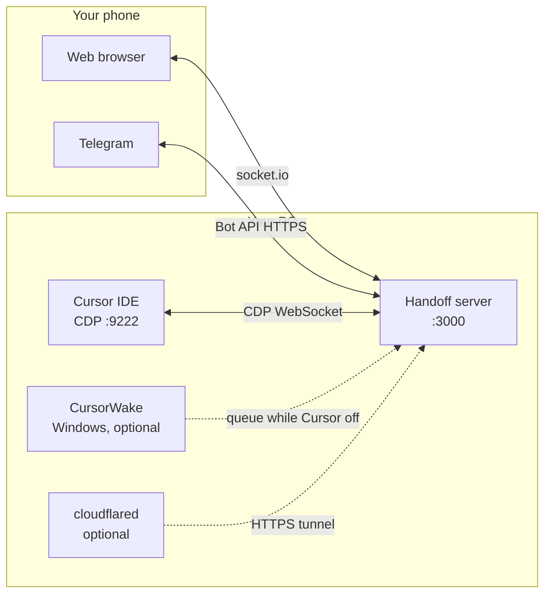

<div align="right">

**Languages:** English · [Русский](README.ru.md)

</div>

<div align="center">

# CursorHandoff

[](https://github.com/W1ldGodlike/CursorHandoff/releases)
[](LICENSE)
[](#requirements)
[](#requirements)

**Control your local Cursor agent from your phone** — live feed, approvals, plan widgets, Telegram bridge.  
Everything runs **on your machine**. No cloud agent runtime. No model hosting.

[Install](#install) · [Quick start](#quick-start) · [Documentation](#documentation) · [Releases](https://github.com/W1ldGodlike/CursorHandoff/releases) · [Report issue](https://github.com/W1ldGodlike/CursorHandoff/issues)

</div>

---

## Table of contents

- [What is CursorHandoff?](#what-is-cursorhandoff)
- [Cursor mobile vs Handoff](#cursor-mobile-vs-handoff)
- [Features](#features)
- [How it works](#how-it-works)
- [Requirements](#requirements)
- [Install](#install)
- [Quick start](#quick-start)
- [Add-ons](#add-ons)
- [Telegram bridge](#telegram-bridge)
- [Reach your phone](#reach-your-phone)
- [Where data lives](#where-data-lives)
- [Security](#security)
- [Troubleshooting](#troubleshooting)
- [Build from source](#build-from-source)
- [Documentation](#documentation)
- [License](#license)

---

## What is CursorHandoff?

CursorHandoff is a **Cursor / VS Code extension** plus a **local Node server** that:

1. Reads your Cursor IDE over **Chrome DevTools Protocol (CDP)** on port `9222`
2. Serves a **mobile web client** on `http://<host>:3000`
3. Optionally mirrors chats into **Telegram forum topics** (one thread per chat tab)

You approve tool runs, send follow-ups, attach files (photos and documents), and watch the agent work — from a browser or Telegram — while models and agents still run **inside Cursor on your PC**.

---

## Cursor mobile vs Handoff

Cursor ships **[Cursor for iOS](https://cursor.com/docs/cloud-agent/mobile)** (public beta, June 2026) and **[cursor.com/agents](https://cursor.com/agents)** (web + PWA on Android). **CursorHandoff** is a separate open-source extension: it mirrors your **local** Cursor session over CDP — not Cursor’s cloud-agent inbox.

Use this section to pick the right tool (or both).

**CursorHandoff runs on any phone** where a normal web browser or Telegram works — iPhone, Android, or anything else. No native app required.

### Two approaches

| | **Cursor mobile** (iOS app, web, Remote Control) | **CursorHandoff** |
|---|---|---|
| **What it controls** | **Cloud Agents** in Cursor’s cloud (+ optional **Remote Control** of a local session) | The **same local agent chat** you already have in the IDE |
| **Where the agent runs** | Agent loop in **Cursor cloud**; tools on a **VM**, **your machine** (My Machines / Remote Control), or both | Entirely **inside Cursor on your PC** — Handoff is a remote UI |
| **Repo / git** | Cloud agents clone from GitHub/GitLab/…; Remote Control needs a **git remote** | Any workspace folder; git optional |
| **Privacy** | Cloud Agents need **Privacy Mode** with cloud storage (Legacy mode blocks mobile) | Code stays on your machine; optional Telegram bridge |
| **Billing** | Paid Cursor plan + Cloud Agent usage ([API pricing](https://cursor.com/docs/cloud-agent)) | Your existing Cursor subscription; Handoff itself is free (AGPL) |
| **PC while away** | Cloud agents keep working if the laptop sleeps; **Remote Control** needs the PC **awake and online** | CDP to local Cursor — PC must run Cursor (or [CursorWake](docs/guide.md#cursor-wake) on Windows to boot it) |

Official docs: [Cloud Agents](https://cursor.com/docs/cloud-agent) · [Cursor for iOS](https://cursor.com/docs/cloud-agent/mobile) · [Remote Control](https://cursor.com/docs/cloud-agent/mobile#remote-control).

### Feature comparison

| Feature | Cursor iOS / web / Remote Control | CursorHandoff |
|---------|-----------------------------------|---------------|
| **Native iOS app** | ✅ Public beta | ✅ Any browser or Telegram on any platform |
| **Native Android app** | ❌ PWA only ([cursor.com/agents](https://cursor.com/agents)) | ✅ Any browser or Telegram on any platform |
| **Telegram bridge** | ❌ | ✅ Forum topic per tab, slash commands — [guide](docs/telegram.md) |
| **Live local agent chat** | Remote Control only (narrow path) | ✅ Main use case — same tabs and composer as the IDE |
| **Run / Skip / Confirm search / Delete file approvals** | Cloud agents auto-run terminal; different model for RC | ✅ Same approval cards as the IDE (shell, web-search confirm, file delete) |
| **AskQuestion / surveys** | In the mobile agent chat | ✅ **Web:** full functionality like the IDE. **Telegram:** inline A/B/C + Reply — [guide](docs/telegram.md#askquestion--questionnaires) |
| **Plan widget (View Plan / Build)** | ❌ | ✅ Web + Telegram |
| **File relay → Telegram** | Cloud artifacts / PR attachments | ✅ Ask the agent in chat to send you a file in Telegram ([outbox](docs/telegram.md#cursor--telegram) + `cursor-handoff-telegram-send` skill) |
| **Attach files from phone** | In-app attach / Design Mode | ✅ Web paste + TG inbound — images to composer; other types as paths |
| **Mode / model from phone** | Mobile UI + slash commands | ✅ Web header pills + `/set_mode`, `/pick_model` in TG |
| **Open / close projects from phone** | Pick **repo + branch** (git) | ✅ `/projects`, web project picker — [guide](docs/guide.md#projects-from-the-web-client) |
| **Cursor fully closed** | Cloud agents still run | Windows: [CursorWake](docs/guide.md#cursor-wake) queues TG and boots Cursor; without Wake, nothing until you open Cursor |
| **Merge PR from phone** | ✅ PR review UI in the app | ✅ Ask in chat — the agent runs git/gh for you; no PR screen, git through conversation |
| **Push / Live Activities** | ✅ iOS push + lock-screen Live Activities | ✅ Ask in chat (e.g. notify when done, merge when CI passes); Telegram mirrors activity — not iOS Live Activities |
| **Voice input** | ✅ iOS app | ✅ Built into most phone keyboards — dictate into the message field, edit if needed, then send |
| **Design Mode (draw on screenshots)** | ✅ Built into the iOS app | ✅ Built into any phone: screenshot → markup in the OS → attach in web or TG with your prompt |
| **Localization** | English only (iOS beta) | ✅ **en** + **ru** shipped; add any language in [`locales/`](locales/) |
| **Reach phone without VPN** | Cursor cloud (your account) | LAN, [Tailscale](docs/guide.md#tailscale), or [Cloudflare quick tunnel](docs/guide.md#cloudflare) to your `:3000` |
| **Privacy Mode (Legacy)** | ❌ Blocks Cloud Agents / mobile | ✅ Handoff does not require cloud agents |
| **Multi-window Cursor** | Not applicable | ✅ One server; owner / observer windows |

**Rule of thumb:** choose **Cursor mobile** for cloud agents, PR review UI, and work while the laptop is off. Choose **Handoff** for **Telegram**, **1:1 local IDE mirror**, **approvals**, **plan Build from TG**, and **no cloud-agent dependency**. **Remote Control** and Handoff overlap for “nudge the agent on your PC from the phone” — different plumbing (cloud handoff vs CDP).

---

## Features

| Area | What you get |
|------|----------------|
| **Web client** | Live chat feed, tool approval cards (shell, Confirm search, Delete file, **Generate image**; optional approve sound), **edit-tool diffs** (compact or 4-line preview + ▼ expand), **generated image previews**, plan widgets (View Plan / Build), code & diff blocks, file attachments (images paste; other files via path; send spinner while uploading), queue & `$` force-send, **project picker** (header + ⋮ menu: open/switch/close projects) |
| **Telegram** | Forum topic per tab, slash commands, inbound files (images, video, voice, documents), outbound [file relay](docs/telegram.md) from `.cursor-handoff/outbox/`, **automatic `sendPhoto` for agent-generated images** |
| **Handoff settings** | One panel: network bind, web password, Telegram setup, add-ons — UI in **English** or **Russian** |
| **Sidebar diagnostics** | **Test CDP** / **Test Telegram bot** (no server required), **Restart server** (owner), version and tunnel status |
| **Handoff log** | Merged `<data-root>/handoff.log` — server visor combines server, extension, and Wake lines (`[server\|ext\|wake]` + local time + JSON); open from sidebar |
| **Cursor upgrade advisory** | Toast, Telegram # General, and web banner when Cursor ≠ version pinned at package build (`testedCursorVersion` on `/health`) |
| **CursorWake** (Windows) | Tray app: queue Telegram while Cursor is off, launch IDE on message, `/pause` & `/resume` |
| **Cloudflare tunnel** | Optional `*.trycloudflare.com` HTTPS link — no VPN on the phone |
| **Multi-window** | One server per PC; first healthy window **owns**, others **observe** |
| **Agent skills** | On install: copies `cursor-handoff-telegram-send` & `plan-widget-tg` skills + patches User Rules |

---

## How it works



Three runtimes, two outward bridges. Details: [Architecture overview](docs/architecture.md).

---

## Requirements

| Component | Requirement |
|-----------|-------------|
| **IDE** | [Cursor](https://cursor.com) (or VS Code 1.85+) with `--remote-debugging-port=9222` |
| **OS** | Extension & server: **Windows, macOS, Linux** |
| **CursorWake** | **Windows only** (optional) |
| **cloudflared** | Windows / macOS / Linux (optional, for quick tunnel) |
| **Telegram** | Supergroup with **Topics**, bot token (optional) |
| **Web access** | LAN, [Tailscale](docs/guide.md#tailscale), or [Cloudflare quick tunnel](docs/guide.md#cloudflare) for remote access |

---

## Install

### Choose a release package

Both packages share the same extension ID (`cursor-handoff.cursor-handoff`). Pick one [GitHub Release](https://github.com/W1ldGodlike/CursorHandoff/releases) asset:

| Package | File | Size | Best for |
|---------|------|------|----------|
| **Standard** | `cursor-handoff-1.5.0.vsix` | ~2 MB | Smaller download; Wake & cloudflared via **Download & install** in Handoff settings (GitHub / Cloudflare CDN) |
| **Complete** | `cursor-handoff-1.5.0-complete.vsix` | ~43 MB | **Bundled add-ons** — `CursorWake.exe` + `cloudflared.exe` (Windows) already inside the VSIX; install from Handoff settings with **no separate download** |

Complete does not mean “works without internet” — Telegram, tunnels, and Cursor still need network. It only ships the add-on binaries in the VSIX so Handoff settings does not fetch them from GitHub or Cloudflare CDN.

**Also on Releases (Standard Wake):** `CursorWake-windows.exe` — used when you install Wake from Handoff settings without the Complete VSIX.

### Install the VSIX

**Cursor UI:** Extensions → `…` → **Install from VSIX…** → pick the `.vsix` file.

**CLI:**

```bash
cursor --install-extension cursor-handoff-1.5.0.vsix
# or Complete:
cursor --install-extension cursor-handoff-1.5.0-complete.vsix
```

VS Code users may substitute `code` for `cursor`.

### First launch

1. Reload Cursor if prompted.
2. Open **CursorHandoff** in the activity bar — server should start (`cursorHandoff.autoStart`, default **on**).
3. Open **CursorHandoff: Open Handoff settings** — copy the **web password**, set locale, **Web access**, Telegram.
4. Follow the in-editor **walkthrough** (CDP, web access, Telegram, add-ons).

Full walkthrough: [Getting started guide](docs/guide.md).

---

## Quick start

| Step | Action |
|------|--------|
| **1** | Launch Cursor with `--remote-debugging-port=9222` ([Windows / macOS / Linux](docs/guide.md#enable-cdp)) |
| **2** | Install a VSIX (above). Confirm sidebar shows **Running** and **Connected** |
| **3** | **Handoff settings** → **Web access**: password + bind (Localhost / LAN / Custom) if needed |
| **4** | Optional: **Add-ons** → **Download & install** cloudflared and/or CursorWake (Windows) |
| **5** | Phone: open `http://<host>:3000` **or** finish [Telegram setup](docs/telegram.md) and send `/bridge` in **# General** |

**Sanity checks**

- CDP: `http://localhost:9222/json` returns a JSON list (not `[]`)
- Server: `http://127.0.0.1:3000/health` → `connected: true`, `build.compatVersion: 1`

---

## Add-ons

Install from **Handoff settings → Add-ons** (or Command Palette).

| Add-on | Platforms | Standard VSIX | Complete VSIX |
|--------|-----------|---------------|---------------|
| **CursorWake** | Windows | Downloads `CursorWake-windows.exe` from this repo's Releases | Copies bundled exe → `%LOCALAPPDATA%\CursorWake\` |
| **cloudflared** | All | Downloads from [cloudflare/cloudflared](https://github.com/cloudflare/cloudflared/releases); winget fallback on Windows | **Windows:** copies bundled `cloudflared.exe` → `%LOCALAPPDATA%\cloudflared\`. **macOS/Linux:** same download path as Standard (Complete ships only Windows binaries) |
| **Agent skills** | All | Auto-installed on extension activation; manual: **Install agent skills** | Same |

Toggle **autostart** for Wake (Windows Startup) and Cloudflare tunnel (`cursorHandoff.webTunnel.enabled`) in the same panel.

---

## Telegram bridge

Mirror each Cursor chat tab to a **forum topic** in a Telegram supergroup:

- Stream agent activity to your phone
- Slash commands: `/bridge`, `/new_chat`, `/web_url`, `/pause`, `/resume`, …
- Inbound files → composer (images) or disk paths in message (other types); agent files → `.cursor-handoff/outbox/` → Telegram

**Five-step setup** lives in Handoff settings → **Telegram** (token, allowlist, group, `/register`, `/bridge` in **# General**).

→ [Telegram bridge guide](docs/telegram.md)

---

## Reach your phone

| Method | When to use | Doc |
|--------|-------------|-----|
| **Same Wi‑Fi (LAN)** | Phone on home network; bind `0.0.0.0` + password | [guide § LAN](docs/guide.md#remote-access) |
| **Tailscale** | Private mesh VPN; stable IP, no port forward | [guide § Tailscale](docs/guide.md#tailscale) |
| **Cloudflare quick tunnel** | Temporary public HTTPS; new hostname when **cloudflared** restarts — Handoff/Cursor restarts usually keep the same link | [guide § Cloudflare](docs/guide.md#cloudflare) |

Never expose the server without a **strong web password**.

---

## Where data lives

Handoff picks a **data root** first. Paths in the next table are under that root unless noted.

When `cursorHandoff.dataDir` is empty, the extension walks **workspace folders**, then the **extension install folder**, looking for `package.json` with `"name": "cursor-handoff"`. If found → `<that-folder>/data/`. If not → extension global storage (rare).

| Scenario | Typical `<data-root>` |
|----------|-------------------------|
| Custom `cursorHandoff.dataDir` | Your path |
| Developing in this git repo | `<repo>/data/` |
| VSIX installed, any workspace open | `<IDE-extensions>/cursor-handoff.cursor-handoff-<version>/data/` |
| Fallback (missing package.json) | Global storage (table below) |

| What | Path |
|------|------|
| Bot state, queue, tunnel URL, logs | `<data-root>/` |
| Telegram auth tokens | `<data-root>/telegram-auth.json` |
| Merged diagnostic log | `<data-root>/handoff.log` (visor; sidebar **Handoff log**) |
| Server / extension / Wake raw logs | `<data-root>/handoff-server.log`, `handoff-ext.log`, `cursor-wake.log` |
| Outbox (files to Telegram) | `<workspace>/.cursor-handoff/outbox/` (auto-purge after 1 h) |
| Inbound file staging | `<workspace>/.cursor-handoff/file-relay/` (`photo/inbound/`, `inbound/`) |
| CursorWake install (Windows) | `%LOCALAPPDATA%\CursorWake\` |
| cloudflared (user install) | Windows: `%LOCALAPPDATA%\cloudflared\` · macOS/Linux: `~/.local/bin/cloudflared` (or Homebrew / system path) |

**Installed VSIX example (Windows, Cursor):** `%USERPROFILE%\.cursor\extensions\cursor-handoff.cursor-handoff-1.5.0\data\`  
VS Code: `~/.vscode/extensions/cursor-handoff.cursor-handoff-1.5.0/data/`

**Global storage fallback** (only when no `cursor-handoff` package root is found):

| OS | Cursor |
|----|--------|
| Windows | `%APPDATA%\Cursor\User\globalStorage\cursor-handoff.cursor-handoff\` |
| macOS | `~/Library/Application Support/Cursor/User/globalStorage/cursor-handoff.cursor-handoff/` |
| Linux | `~/.config/Cursor/User/globalStorage/cursor-handoff.cursor-handoff/` |

Handoff settings shows the active path and source. Installed VSIX usually labels the folder **Project default (./data)** (the extension install directory), not global storage. Server, extension disk logs, and CursorWake (when launched by Handoff) all share one `DATA_DIR`.

**CursorWake alone** (tray started without Handoff `DATA_DIR`): on Windows defaults to global storage per `wake/config.py`.

Full reference: [Settings & paths](docs/reference.md#storage).

---

## Security

- Default bind: **localhost only** (`cursorHandoff.serverHost = 127.0.0.1`)
- Random **web password** generated on first activation — required for LAN / Tailscale / tunnel
- `/health` returns minimal info until the web client authenticates
- Telegram: numeric **allowlist** and/or `/register <token>` in the supergroup
- Failed web logins: **10 attempts / minute / IP**

→ [SECURITY.md](SECURITY.md) for responsible disclosure.

---

## Troubleshooting

| Symptom | First check |
|---------|-------------|
| Sidebar **No CDP** / disconnected | Cursor launched with `--remote-debugging-port=9222`; visit `localhost:9222/json` |
| Phone cannot open `:3000` | Firewall; server still on `127.0.0.1`; use LAN IP or Tailscale |
| Telegram bot silent | [Bot won't connect](docs/telegram.md#bot-wont-connect); `telegramPoll: true` in `/health` |
| Tunnel URL missing | Handoff settings → install cloudflared → Start; log: `<data-root>/cloudflared-quick.log` |
| Wake not starting | Handoff settings → Download & install Wake; tray **Raise Cursor** checked |
| Web UI stale on macOS | Cursor backgrounded — bring to foreground; CDP may pause |
| Need logs or error codes | Sidebar **Handoff log** → `<data-root>/handoff.log` (merged every 4 s); raw: `handoff-server.log`, `handoff-ext.log`, `cursor-wake.log` |
| Cursor upgrade warning | Informational — compare `cursorVersion` vs `testedCursorVersion` on `/health`; update Cursor or dismiss the banner |

More: [Getting started — common blockers](docs/guide.md#appendix-common-blockers).

---

## Build from source

```bash
git clone https://github.com/W1ldGodlike/CursorHandoff.git
cd CursorHandoff
npm install
npm run package          # both Standard + Complete VSIX → releases/
# or:
npm run package:standard
npm run package:complete
```

Install from `releases/`. Build and release: [Development guide](docs/development.md).

---

## Documentation

| Document | For |
|----------|-----|
| [Getting started guide](docs/guide.md) | CDP, Handoff settings, network, Wake, [who opens projects from TG](docs/guide.md#opening-projects-from-telegram), tunnels, [diagnostics & logs](docs/guide.md#diagnostics-and-logs) |
| [README — Cursor mobile vs Handoff](README.md#cursor-mobile-vs-handoff) | Compare Handoff to Cursor for iOS, web agents, and Remote Control |
| [Telegram bridge guide](docs/telegram.md) | Bot, commands, file relay, fixes |
| [Settings reference](docs/reference.md) | Every `cursorHandoff.*` key, `/health`, files on disk |
| [Architecture overview](docs/architecture.md) | Contributors — CDP, state, Telegram transport |
| [Development guide](docs/development.md) | Build, logs, release, Cursor compat |
| [AGENTS.md](AGENTS.md) | AI coding agents working in this repo |
| [CHANGELOG.md](CHANGELOG.md) | Release history |

**In-product UI languages:** English & Russian (`cursorHandoff.locale` in Handoff settings).

---

## License

[AGPL-3.0-or-later](LICENSE) — see [LICENSE](LICENSE).

---

<div align="center">

**[⬆ Back to top](#cursorhandoff)**

Made for developers who want their agent in their pocket — without sending code to a third-party runtime.

</div>
