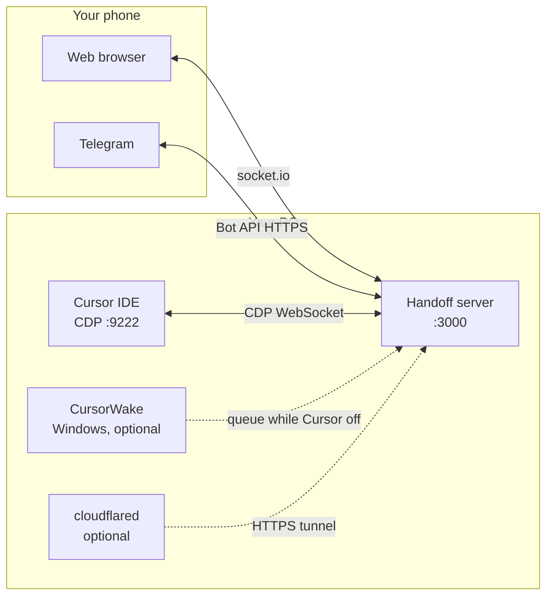

<div align="right">

**Languages:** English · [Русский](README.ru.md)

</div>

<div align="center">

# CursorHandoff

[](https://github.com/W1ldGodlike/CursorHandoff/releases)
[](LICENSE)
[](#requirements)
[](#prerequisites)

**Control your local Cursor agent from your phone** — live feed, approvals, plan widgets, Telegram bridge.  
Everything runs **on your machine**. No cloud agent runtime. No model hosting.

[Install](#install) · [Quick start](#quick-start) · [Documentation](#documentation) · [Releases](https://github.com/W1ldGodlike/CursorHandoff/releases) · [Report issue](https://github.com/W1ldGodlike/CursorHandoff/issues)

</div>

---

## Table of contents

- [What is CursorHandoff?](#what-is-cursorhandoff)
- [Features](#features)
- [How it works](#how-it-works)
- [Requirements](#requirements)
- [Install](#install)
- [Quick start](#quick-start)
- [Add-ons](#add-ons)
- [Telegram bridge](#telegram-bridge)
- [Reach your phone](#reach-your-phone)
- [Where data lives](#where-data-lives)
- [Security](#security)
- [Troubleshooting](#troubleshooting)
- [Build from source](#build-from-source)
- [Documentation](#documentation)
- [License](#license)

---

## What is CursorHandoff?

CursorHandoff is a **Cursor / VS Code extension** plus a **local Node server** that:

1. Reads your Cursor IDE over **Chrome DevTools Protocol (CDP)** on port `9222`
2. Serves a **mobile web client** on `http://<host>:3000`
3. Optionally mirrors chats into **Telegram forum topics** (one thread per chat tab)

You approve tool runs, send follow-ups, attach files (photos and documents), and watch the agent work — from a browser or Telegram — while models and agents still run **inside Cursor on your PC**.

---

## Features

| Area | What you get |
|------|----------------|
| **Web client** | Live chat feed, tool approval cards, plan widgets (View Plan / Build), code & diff blocks, file attachments (images paste; other files via path), queue & `$` force-send |
| **Telegram** | Forum topic per tab, slash commands, reply keyboard, inbound files (images, video, voice, documents), outbound [file relay](docs/telegram.md) from `.cursor-handoff/outbox/` |
| **Handoff settings** | One panel: network bind, web password, Telegram setup, add-ons — UI in **English** or **Russian** |
| **CursorWake** (Windows) | Tray app: queue Telegram while Cursor is off, launch IDE on message, `/pause` & `/resume` |
| **Cloudflare tunnel** | Optional `*.trycloudflare.com` HTTPS link — no VPN on the phone |
| **Multi-window** | One server per PC; first healthy window **owns**, others **observe** |
| **Agent skills** | On install: copies `cursor-handoff-telegram-send` & `plan-widget-tg` skills + patches User Rules |

---

## How it works



Three runtimes, two outward bridges. Details: [Architecture overview](docs/architecture.md).

---

## Requirements

| Component | Requirement |
|-----------|-------------|
| **IDE** | [Cursor](https://cursor.com) (or VS Code 1.85+) with `--remote-debugging-port=9222` |
| **OS** | Extension & server: **Windows, macOS, Linux** |
| **CursorWake** | **Windows only** (optional) |
| **cloudflared** | Windows / macOS / Linux (optional, for quick tunnel) |
| **Telegram** | Supergroup with **Topics**, bot token (optional) |
| **Web access** | LAN, [Tailscale](docs/guide.md#tailscale), or [Cloudflare quick tunnel](docs/guide.md#cloudflare) for remote access |

---

## Install

### Choose a release package

Both packages share the same extension ID (`cursor-handoff.cursor-handoff`). Pick one [GitHub Release](https://github.com/W1ldGodlike/CursorHandoff/releases) asset:

| Package | File | Size | Best for |
|---------|------|------|----------|
| **Standard** | `cursor-handoff-1.0.0.vsix` | ~2 MB | Smaller download; Wake & cloudflared via **Download & install** in Handoff settings (GitHub / Cloudflare CDN) |
| **Complete** | `cursor-handoff-1.0.0-complete.vsix` | ~43 MB | **Bundled add-ons** — `CursorWake.exe` + `cloudflared.exe` (Windows) already inside the VSIX; install from Handoff settings with **no separate download** |

Complete does not mean “works without internet” — Telegram, tunnels, and Cursor still need network. It only ships the add-on binaries in the VSIX so Handoff settings does not fetch them from GitHub or Cloudflare CDN.

**Also on Releases (Standard Wake):** `CursorWake-windows.exe` — used when you install Wake from Handoff settings without the Complete VSIX.

### Install the VSIX

**Cursor UI:** Extensions → `…` → **Install from VSIX…** → pick the `.vsix` file.

**CLI:**

```bash
cursor --install-extension cursor-handoff-1.0.0.vsix
# or Complete:
cursor --install-extension cursor-handoff-1.0.0-complete.vsix
```

VS Code users may substitute `code` for `cursor`.

### First launch

1. Reload Cursor if prompted.
2. Open **CursorHandoff** in the activity bar — server should start (`cursorHandoff.autoStart`, default **on**).
3. Open **CursorHandoff: Open Handoff settings** — copy the **web password**, set locale, **Web access**, Telegram.
4. Follow the in-editor **walkthrough** (CDP, web access, Telegram, add-ons).

Full walkthrough: [Getting started guide](docs/guide.md).

---

## Quick start

| Step | Action |
|------|--------|
| **1** | Launch Cursor with `--remote-debugging-port=9222` ([Windows / macOS / Linux](docs/guide.md#enable-cdp)) |
| **2** | Install a VSIX (above). Confirm sidebar shows **Running** and **Connected** |
| **3** | **Handoff settings** → **Web access**: password + bind (Localhost / LAN / Custom) if needed |
| **4** | Optional: **Add-ons** → **Download & install** cloudflared and/or CursorWake (Windows) |
| **5** | Phone: open `http://<host>:3000` **or** finish [Telegram setup](docs/telegram.md) and send `/bridge` in **# General** |

**Sanity checks**

- CDP: `http://localhost:9222/json` returns a JSON list (not `[]`)
- Server: `http://127.0.0.1:3000/health` → `connected: true`, `build.compatVersion: 1`

---

## Add-ons

Install from **Handoff settings → Add-ons** (or Command Palette).

| Add-on | Platforms | Standard VSIX | Complete VSIX |
|--------|-----------|---------------|---------------|
| **CursorWake** | Windows | Downloads `CursorWake-windows.exe` from this repo's Releases | Copies bundled exe → `%LOCALAPPDATA%\CursorWake\` |
| **cloudflared** | All | Downloads from [cloudflare/cloudflared](https://github.com/cloudflare/cloudflared/releases); winget fallback on Windows | Copies bundled exe → `%LOCALAPPDATA%\cloudflared\` |
| **Agent skills** | All | Auto-installed on extension activation; manual: **Install agent skills** | Same |

Toggle **autostart** for Wake (Windows Startup) and Cloudflare tunnel (`cursorHandoff.webTunnel.enabled`) in the same panel.

---

## Telegram bridge

Mirror each Cursor chat tab to a **forum topic** in a Telegram supergroup:

- Stream agent activity to your phone
- Slash commands: `/bridge`, `/new_chat`, `/web_url`, `/pause`, `/resume`, …
- Inbound files → composer (images) or disk paths in message (other types); agent files → `.cursor-handoff/outbox/` → Telegram

**Five-step setup** lives in Handoff settings → **Telegram** (token, allowlist, group, `/register`, `/bridge` in **# General**).

→ [Telegram bridge guide](docs/telegram.md)

---

## Reach your phone

| Method | When to use | Doc |
|--------|-------------|-----|
| **Same Wi‑Fi (LAN)** | Phone on home network; bind `0.0.0.0` + password | [guide § LAN](docs/guide.md#remote-access) |
| **Tailscale** | Private mesh VPN; stable IP, no port forward | [guide § Tailscale](docs/guide.md#tailscale) |
| **Cloudflare quick tunnel** | Temporary public HTTPS; new hostname when **cloudflared** restarts — Handoff/Cursor restarts usually keep the same link | [guide § Cloudflare](docs/guide.md#cloudflare) |

Never expose the server without a **strong web password**.

---

## Where data lives

| What | Default path |
|------|----------------|
| Bot state, queue, tunnel URL | `<repo>/data/` (override: `cursorHandoff.dataDir`) |
| Telegram auth tokens | `data/telegram-auth.json` |
| Outbox (files to Telegram) | `<workspace>/.cursor-handoff/outbox/` (auto-purge after 1 h) |
| Inbound file staging | `<workspace>/.cursor-handoff/file-relay/` (`photo/inbound/`, `inbound/`) |
| CursorWake install (Windows) | `%LOCALAPPDATA%\CursorWake\` |
| cloudflared (user install) | `%LOCALAPPDATA%\cloudflared\` or `~/.local/bin/cloudflared` |

Full reference: [Settings & paths](docs/reference.md).

---

## Security

- Default bind: **localhost only** (`cursorHandoff.serverHost = 127.0.0.1`)
- Random **web password** generated on first activation — required for LAN / Tailscale / tunnel
- `/health` returns minimal info until the web client authenticates
- Telegram: numeric **allowlist** and/or `/register <token>` in the supergroup
- Failed web logins: **10 attempts / minute / IP**

→ [SECURITY.md](SECURITY.md) for responsible disclosure.

---

## Troubleshooting

| Symptom | First check |
|---------|-------------|
| Sidebar **No CDP** / disconnected | Cursor launched with `--remote-debugging-port=9222`; visit `localhost:9222/json` |
| Phone cannot open `:3000` | Firewall; server still on `127.0.0.1`; use LAN IP or Tailscale |
| Telegram bot silent | [Bot won't connect](docs/telegram.md#bot-wont-connect); `telegramPoll: true` in `/health` |
| Tunnel URL missing | Handoff settings → install cloudflared → Start; log: `data/cloudflared-quick.log` |
| Wake not starting | Handoff settings → Download & install Wake; tray **Raise Cursor** checked |
| Web UI stale on macOS | Cursor backgrounded — bring to foreground; CDP may pause |

More: [Getting started — common blockers](docs/guide.md#appendix-common-blockers).

---

## Build from source

```bash
git clone https://github.com/W1ldGodlike/CursorHandoff.git
cd CursorHandoff
npm install
npm run package          # both Standard + Complete VSIX → releases/
# or:
npm run package:standard
npm run package:complete
```

Install from `releases/`. Maintainer smoke tests: [Development guide](docs/development.md).

---

## Documentation

| Document | For |
|----------|-----|
| [Getting started guide](docs/guide.md) | CDP, Handoff settings, network, Wake, tunnels |
| [Telegram bridge guide](docs/telegram.md) | Bot, commands, file relay, fixes |
| [Settings reference](docs/reference.md) | Every `cursorHandoff.*` key, `/health`, files on disk |
| [Architecture overview](docs/architecture.md) | Contributors — CDP, state, Telegram transport |
| [Development guide](docs/development.md) | Pre-release smoke, Wake acceptance |
| [AGENTS.md](AGENTS.md) | AI coding agents working in this repo |
| [CHANGELOG.md](CHANGELOG.md) | Release history |

**In-product UI languages:** English & Russian (`cursorHandoff.locale` in Handoff settings).

---

## License

[AGPL-3.0-or-later](LICENSE) — see [LICENSE](LICENSE).

---

<div align="center">

**[⬆ Back to top](#cursorhandoff)**

Made for developers who want their agent in their pocket — without sending code to a third-party runtime.

</div>
