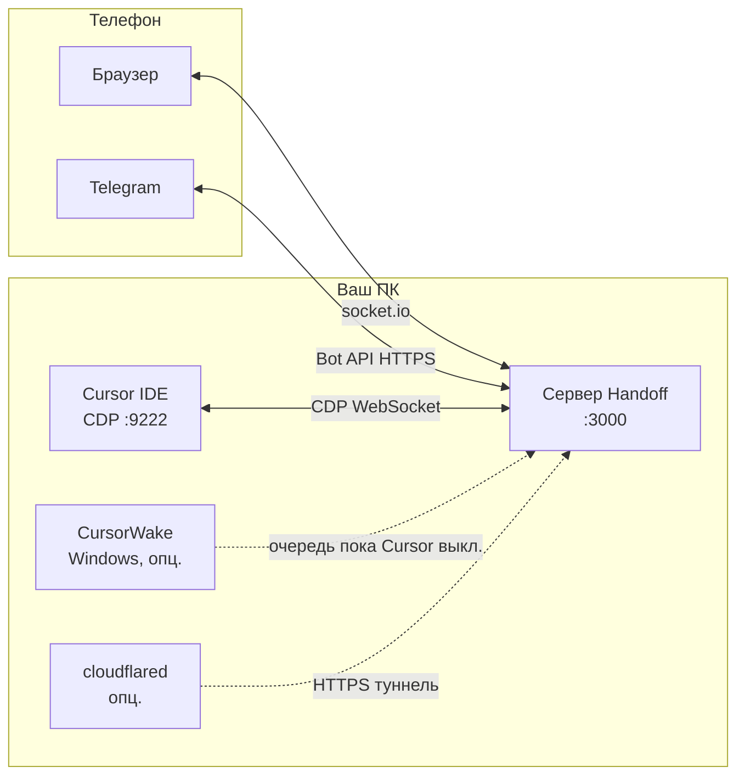

<div align="right">

**Языки:** [English](README.md) · Русский

</div>

<div align="center">

# CursorHandoff

[](https://github.com/W1ldGodlike/CursorHandoff/releases)
[](LICENSE)
[](#требования)
[](#предварительные-требования)

**Управляйте локальным агентом Cursor с телефона** — веб-клиент, Telegram, без облачного рантайма.  
Всё работает **на вашем компьютере**. Модели не уезжают на чужой сервер.

[Установка](#установка) · [Быстрый старт](#быстрый-старт) · [Документация](#документация) · [Релизы](https://github.com/W1ldGodlike/CursorHandoff/releases) · [Сообщить о проблеме](https://github.com/W1ldGodlike/CursorHandoff/issues)

</div>

---

## Содержание

- [Что такое CursorHandoff?](#что-такое-cursorhandoff)
- [Возможности](#возможности)
- [Как это устроено](#как-это-устроено)
- [Требования](#требования)
- [Установка](#установка)
- [Быстрый старт](#быстрый-старт)
- [Дополнения](#дополнения)
- [Мост Telegram](#мост-telegram)
- [Доступ с телефона](#доступ-с-телефона)
- [Где лежат данные](#где-лежат-данные)
- [Безопасность](#безопасность)
- [Решение проблем](#решение-проблем)
- [Сборка из исходников](#сборка-из-исходников)
- [Документация](#документация)
- [Лицензия](#лицензия)

---

## Что такое CursorHandoff?

**CursorHandoff** — расширение для **Cursor / VS Code** и **локальный сервер на Node**, который:

1. Читает Cursor через **Chrome DevTools Protocol (CDP)** на порту `9222`
2. Отдаёт **мобильный веб-клиент** на `http://<хост>:3000`
3. По желанию зеркалит чаты в **топики форума Telegram** (один тред на вкладку чата)

Вы подтверждаете запуск инструментов, дописываете задачи, прикрепляете файлы (фото и документы) и следите за агентом — из браузера или Telegram — пока модели и агенты крутятся **внутри Cursor на вашем ПК**.

---

## Возможности

| Область | Что даёт |
|---------|----------|
| **Веб-клиент** | Живая лента, карточки Run/Skip, виджеты плана (View Plan / Build), код и диффы, вложения (картинки — paste, остальное — путь к файлу), очередь и `$` |
| **Telegram** | Топик форума на вкладку, слэш-команды, reply-клавиатура, входящие файлы (фото, видео, голос, документы), исходящий [file relay](docs/telegram.md) из `.cursor-handoff/outbox/` |
| **Handoff settings** | Одна панель: сеть, пароль веба, Telegram, дополнения — интерфейс на **английском** или **русском** |
| **CursorWake** (Windows) | Трей: очередь Telegram при выключенном Cursor, запуск IDE по сообщению, `/pause` и `/resume` |
| **Туннель Cloudflare** | Опциональная HTTPS-ссылка `*.trycloudflare.com` — VPN на телефоне не нужен |
| **Несколько окон** | Один сервер на ПК; первое здоровое окно — **владелец**, остальные — **наблюдатели** |
| **Agent skills** | При установке: skills `cursor-handoff-telegram-send` и `plan-widget-tg` + патч User Rules |

---

## Как это устроено



Три рантайма, два внешних моста. Подробнее: [Architecture overview](docs/architecture.md) (на английском).

---

## Требования

| Компонент | Нужно |
|-----------|--------|
| **IDE** | [Cursor](https://cursor.com) (или VS Code 1.85+) с флагом `--remote-debugging-port=9222` |
| **ОС** | Расширение и сервер: **Windows, macOS, Linux** |
| **CursorWake** | Только **Windows** (опционально) |
| **cloudflared** | Windows / macOS / Linux (опционально, для quick tunnel) |
| **Telegram** | Супергруппа с **топиками**, токен бота (опционально) |
| **Сеть** | LAN, [Tailscale](docs/guide.md#tailscale) или [туннель Cloudflare](docs/guide.md#cloudflare) для удалённого доступа |

---

## Установка

### Какой пакет скачать

Один и тот же ID расширения (`cursor-handoff.cursor-handoff`). На [GitHub Releases](https://github.com/W1ldGodlike/CursorHandoff/releases):

| Пакет | Файл | Размер | Кому подходит |
|-------|------|--------|----------------|
| **Standard** | `cursor-handoff-1.0.0.vsix` | ~2 MB | Меньше вес; Wake и cloudflared — кнопка **Скачать и установить** в Handoff settings (GitHub / CDN Cloudflare) |
| **Complete** | `cursor-handoff-1.0.0-complete.vsix` | ~43 MB | **Дополнения в пакете** — `CursorWake.exe` + `cloudflared.exe` (Windows) уже в VSIX; установка из Handoff settings **без отдельной докачки** |

Complete — не «работает без интернета»: Telegram, туннели и Cursor по-прежнему требуют сеть. Отличие только в том, что exe дополнений уже внутри VSIX, и Handoff settings не качает их с GitHub или CDN Cloudflare.

**На Releases для Standard (Wake):** `CursorWake-windows.exe` — если ставите Wake без Complete VSIX.

### Установка VSIX

**В Cursor:** Extensions → `…` → **Install from VSIX…** → выберите `.vsix`.

**CLI:**

```bash
cursor --install-extension cursor-handoff-1.0.0.vsix
# или Complete:
cursor --install-extension cursor-handoff-1.0.0-complete.vsix
```

В VS Code вместо `cursor` можно `code`.

### Первый запуск

1. Перезагрузите Cursor, если попросит.
2. Откройте **CursorHandoff** на activity bar — сервер должен стартовать (`cursorHandoff.autoStart`, по умолчанию **вкл.**).
3. **CursorHandoff: Open Handoff settings** — скопируйте **пароль веба**, выберите язык, сеть, Telegram.
4. Пройдите **walkthrough** в редакторе (CDP, сеть, Telegram, дополнения).

Полный гайд: [Getting started guide](docs/guide.md) (англ.).

---

## Быстрый старт

| Шаг | Действие |
|-----|----------|
| **1** | Запустите Cursor с `--remote-debugging-port=9222` ([Windows / macOS / Linux](docs/guide.md#enable-cdp)) |
| **2** | Установите VSIX. В сайдбаре: **Running** и **Connected** |
| **3** | **Handoff settings** → пароль, при необходимости адрес привязки |
| **4** | Опционально: **Дополнения** → **Скачать и установить** cloudflared и/или CursorWake (Windows) |
| **5** | Телефон: `http://<хост>:3000` **или** [настройка Telegram](docs/telegram.md) и `/bridge` |

**Проверки**

- CDP: `http://localhost:9222/json` — JSON-список (не пустой `[]`)
- Сервер: `http://127.0.0.1:3000/health` → `connected: true`, `build.compatVersion: 1`

---

## Дополнения

Установка: **Handoff settings → Дополнения** (или Command Palette).

| Дополнение | Платформы | Standard VSIX | Complete VSIX |
|------------|-----------|---------------|---------------|
| **CursorWake** | Windows | Качает `CursorWake-windows.exe` с Releases репозитория | Копирует bundled → `%LOCALAPPDATA%\CursorWake\` |
| **cloudflared** | Все | Качает с [cloudflare/cloudflared](https://github.com/cloudflare/cloudflared/releases); запасной вариант — winget на Windows | Копирует bundled → `%LOCALAPPDATA%\cloudflared\` |
| **Agent skills** | Все | Авто при активации; вручную: **Install agent skills** | То же |

Автозапуск Wake (Startup Windows) и туннеля (`cursorHandoff.webTunnel.enabled`) — в той же панели.

---

## Мост Telegram

Каждая вкладка чата Cursor → **топик форума** в супергруппе Telegram:

- Активность агента на телефоне
- Слэш-команды: `/bridge`, `/new_chat`, `/web_url`, `/pause`, `/resume`, …
- Входящие файлы → composer (картинки) или пути на диске в тексте (остальное); файлы агента → `.cursor-handoff/outbox/` → Telegram

**Пять шагов** — вкладка **Telegram** в Handoff settings (токен, allowlist, супергруппа, `/register`, `/bridge`).

→ [Telegram bridge guide](docs/telegram.md) (англ.)

---

## Доступ с телефона

| Способ | Когда | Документ |
|--------|-------|----------|
| **Wi‑Fi (LAN)** | Телефон в той же сети; bind `0.0.0.0` + пароль | [guide § LAN](docs/guide.md#remote-access) |
| **Tailscale** | Приватная mesh-VPN; стабильный IP | [guide § Tailscale](docs/guide.md#tailscale) |
| **Cloudflare quick tunnel** | Временный публичный HTTPS; новый hostname при **рестарте cloudflared** — рестарты Handoff/Cursor обычно не меняют ссылку | [guide § Cloudflare](docs/guide.md#cloudflare) |

Не открывайте сервер в интернет без **надёжного пароля**.

---

## Где лежат данные

| Что | Путь по умолчанию |
|-----|-------------------|
| Состояние бота, очередь, URL туннеля | `<repo>/data/` (переопределение: `cursorHandoff.dataDir`) |
| Токены Telegram | `data/telegram-auth.json` |
| Исходящие файлы в TG | `<workspace>/.cursor-handoff/outbox/` (автоочистка через 1 ч) |
| Входящие файлы | `<workspace>/.cursor-handoff/file-relay/` (`photo/inbound/`, `inbound/`) |
| Установка CursorWake (Windows) | `%LOCALAPPDATA%\CursorWake\` |
| cloudflared (пользовательская) | `%LOCALAPPDATA%\cloudflared\` или `~/.local/bin/cloudflared` |

Справочник: [Settings reference](docs/reference.md) (англ.).

---

## Безопасность

- По умолчанию bind: **только localhost** (`cursorHandoff.serverHost = 127.0.0.1`)
- Случайный **пароль веба** при первой активации — обязателен для LAN / Tailscale / туннеля
- `/health` отдаёт минимум до авторизации веб-клиента
- Telegram: числовой **allowlist** и/или `/register <token>` в супергруппе
- Неудачные входы в веб: **10 попыток / минуту / IP**

→ [SECURITY.md](SECURITY.md) — ответственное раскрытие уязвимостей.

---

## Решение проблем

| Симптом | С чего начать |
|---------|----------------|
| В сайдбаре **No CDP** / disconnected | Cursor с `--remote-debugging-port=9222`; `localhost:9222/json` |
| Телефон не открывает `:3000` | Файрвол; сервер на `127.0.0.1`; LAN IP или Tailscale |
| Бот молчит | [Bot won't connect](docs/telegram.md#bot-wont-connect); в `/health` — `telegramPoll: true` |
| Нет URL туннеля | Handoff settings → cloudflared → Start; лог: `data/cloudflared-quick.log` |
| Wake не стартует | Handoff settings → Скачать и установить Wake; в трее включён **Raise Cursor** |
| Веб залипает на macOS | Cursor в фоне — выведите на передний план; CDP может засыпать |

Ещё: [Common blockers](docs/guide.md#appendix-common-blockers) в гайде.

---

## Сборка из исходников

```bash
git clone https://github.com/W1ldGodlike/CursorHandoff.git
cd CursorHandoff
npm install
npm run package          # оба VSIX → releases/
# или:
npm run package:standard
npm run package:complete
```

Установите из `releases/`. Smoke-тесты: [Development guide](docs/development.md).

---

## Документация

| Документ | Для кого |
|----------|----------|
| [Getting started guide](docs/guide.md) | CDP, Handoff settings, сеть, Wake, туннели |
| [Telegram bridge guide](docs/telegram.md) | Бот, команды, file relay |
| [Settings reference](docs/reference.md) | Все ключи `cursorHandoff.*`, `/health`, файлы |
| [Architecture overview](docs/architecture.md) | Устройство системы (контрибьюторы) |
| [Development guide](docs/development.md) | Pre-release smoke, Wake acceptance |
| [AGENTS.md](AGENTS.md) | AI-агенты в этом репозитории |
| [CHANGELOG.md](CHANGELOG.md) | История релизов |

**Языки в продукте:** английский и русский (`cursorHandoff.locale` в Handoff settings).

---

## Лицензия

[AGPL-3.0-or-later](LICENSE) — см. [LICENSE](LICENSE).

---

<div align="center">

**[⬆ Наверх](#cursorhandoff)**

Для тех, кто хочет агента в кармане — без отправки кода на чужой рантайм.

</div>
