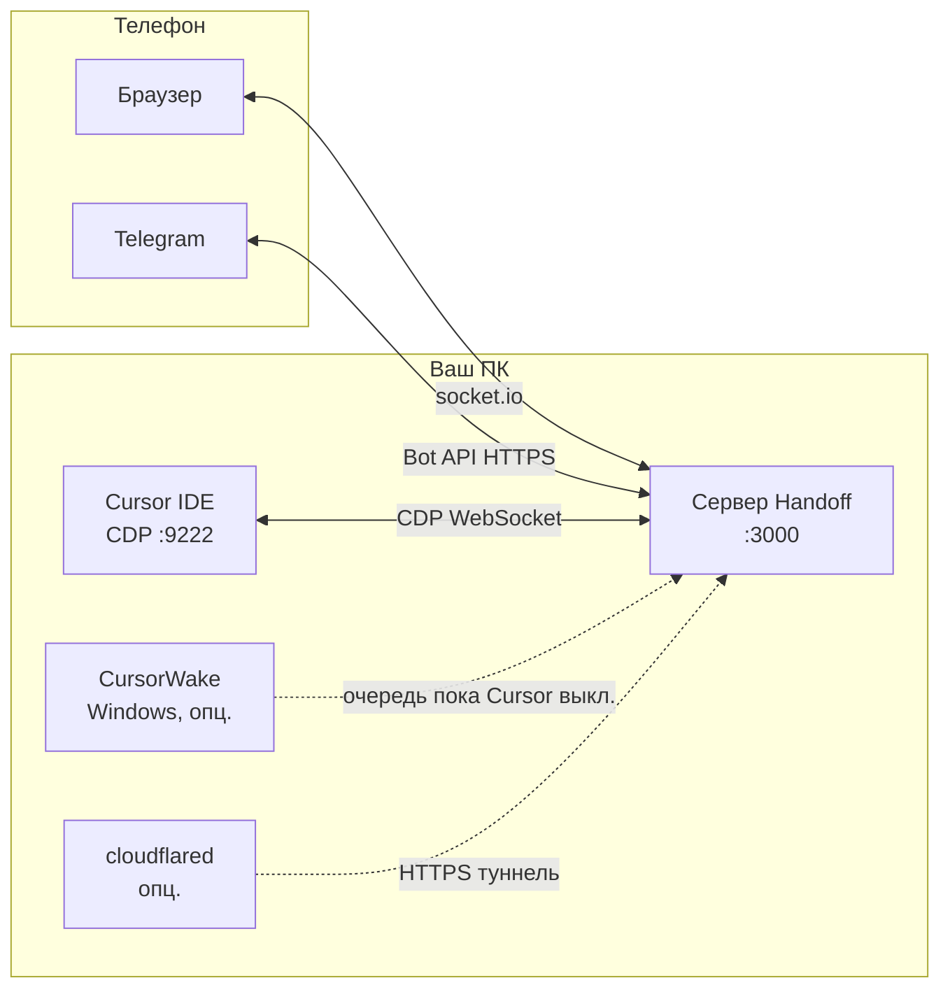

<div align="right">

**Языки:** [English](README.md) · Русский

</div>

<div align="center">

# CursorHandoff

[](https://github.com/W1ldGodlike/CursorHandoff/releases)
[](LICENSE)
[](#требования)
[](#требования)

**Управляйте локальным агентом Cursor с телефона** — веб-клиент, Telegram, без облачного рантайма.  
Всё работает **на вашем компьютере**. Модели не уезжают на чужой сервер.

[Установка](#установка) · [Быстрый старт](#быстрый-старт) · [Документация](#документация) · [Релизы](https://github.com/W1ldGodlike/CursorHandoff/releases) · [Сообщить о проблеме](https://github.com/W1ldGodlike/CursorHandoff/issues)

</div>

---

## Содержание

- [Что такое CursorHandoff?](#что-такое-cursorhandoff)
- [Cursor mobile vs Handoff](#cursor-mobile-vs-handoff)
- [Возможности](#возможности)
- [Как это устроено](#как-это-устроено)
- [Требования](#требования)
- [Установка](#установка)
- [Быстрый старт](#быстрый-старт)
- [Дополнения](#дополнения)
- [Мост Telegram](#мост-telegram)
- [Доступ с телефона](#доступ-с-телефона)
- [Где лежат данные](#где-лежат-данные)
- [Безопасность](#безопасность)
- [Решение проблем](#решение-проблем)
- [Сборка из исходников](#сборка-из-исходников)
- [Документация](#документация)
- [Лицензия](#лицензия)

---

## Что такое CursorHandoff?

**CursorHandoff** — расширение для **Cursor / VS Code** и **локальный сервер на Node**, который:

1. Читает Cursor через **Chrome DevTools Protocol (CDP)** на порту `9222`
2. Отдаёт **мобильный веб-клиент** на `http://<хост>:3000`
3. По желанию зеркалит чаты в **топики форума Telegram** (один тред на вкладку чата)

Вы подтверждаете запуск инструментов, дописываете задачи, прикрепляете файлы (фото и документы) и следите за агентом — из браузера или Telegram — пока модели и агенты крутятся **внутри Cursor на вашем ПК**.

---

## Cursor mobile vs Handoff

У Cursor есть **[приложение для iOS](https://cursor.com/docs/cloud-agent/mobile)** (публичная бета, июнь 2026) и **[cursor.com/agents](https://cursor.com/agents)** (веб + PWA на Android). **CursorHandoff** — отдельное open-source расширение: зеркало **локальной** сессии Cursor через CDP, а не облачный inbox агентов Cursor.

Ниже — чтобы выбрать инструмент (или оба).

**CursorHandoff работает на любом телефоне**, где есть обычный браузер или Telegram — iPhone, Android или что угодно ещё. Нативное приложение не нужно.

### Два подхода

| | **Cursor mobile** (iOS, веб, Remote Control) | **CursorHandoff** |
|---|---|---|
| **Что управляется** | **Cloud Agents** в облаке Cursor (+ опционально **Remote Control** локальной сессии) | **Тот же локальный чат агента**, что в IDE |
| **Где крутится агент** | Loop в **облаке Cursor**; tools на **VM**, **вашем ПК** (My Machines / RC) или оба | Целиком **в Cursor на вашем ПК** — Handoff только удалённый UI |
| **Репо / git** | Cloud agents клонируют из GitHub/GitLab/…; Remote Control нужен **git remote** | Любая папка; git не обязателен |
| **Приватность** | Cloud Agents требуют **Privacy Mode** с облачным хранением (Legacy блокирует mobile) | Код на вашей машине; Telegram по желанию |
| **Оплата** | Paid Cursor + usage Cloud Agents ([API pricing](https://cursor.com/docs/cloud-agent)) | Ваша подписка Cursor; Handoff бесплатен (AGPL) |
| **ПК в отъезде** | Cloud agents работают, если ноут спит; **Remote Control** — ПК **онлайн и не спит** | CDP к локальному Cursor — нужен запущенный Cursor (или [CursorWake](docs/guide.md#cursor-wake) на Windows) |

Доки Cursor: [Cloud Agents](https://cursor.com/docs/cloud-agent) · [iOS](https://cursor.com/docs/cloud-agent/mobile) · [Remote Control](https://cursor.com/docs/cloud-agent/mobile#remote-control).

### Сравнение возможностей

| Возможность | Cursor iOS / веб / Remote Control | CursorHandoff |
|-------------|-----------------------------------|---------------|
| **Нативное iOS** | ✅ Публичная бета | ✅ Любой браузер или Telegram на любой платформе |
| **Нативный Android** | ❌ Только PWA | ✅ Любой браузер или Telegram на любой платформе |
| **Мост Telegram** | ❌ | ✅ Топик на вкладку, слэш-команды — [гайд](docs/telegram.md) |
| **Живой локальный чат** | Только Remote Control (узкий путь) | ✅ Основной сценарий — те же вкладки и composer, что в IDE |
| **Run / Skip approvals** | Cloud agents сами жмут терминал; у RC другая модель | ✅ Те же карточки, что в IDE |
| **AskQuestion / опросники** | В мобильном чате агента | ✅ **Веб:** полный функционал как в IDE. **TG:** кнопки A/B/C + Reply — [гайд](docs/telegram.md#askquestion--questionnaires) |
| **Виджет плана (View Plan / Build)** | ❌ | ✅ Веб + Telegram |
| **File relay → Telegram** | Артефакты cloud / вложения к PR | ✅ Попросите агента в чате прислать файл в Telegram ([outbox](docs/telegram.md#cursor--telegram) + skill `cursor-handoff-telegram-send`) |
| **Файлы с телефона** | Вложения в приложении / Design Mode | ✅ Веб paste + входящие в TG — картинки в composer, остальное путями |
| **Mode / model с телефона** | UI приложения + slash | ✅ Пилюли в веб-шапке + `/set_mode`, `/pick_model` в TG |
| **Открыть / закрыть проект** | **Repo + branch** (git) | ✅ `/projects`, веб-пикер — [гайд](docs/guide.md#projects-from-the-web-client) |
| **Cursor полностью выключен** | Cloud agents работают | Windows: [CursorWake](docs/guide.md#cursor-wake) копит TG и поднимает Cursor; без Wake — тишина |
| **Merge PR с телефона** | ✅ UI ревью PR в приложении | ✅ Промптом в чате — агент сам жмёт git/gh; без экрана PR, git через разговор с агентом |
| **Push / Live Activities** | ✅ Push iOS + Live Activities на локскрине | ✅ Промптом в чате (напиши когда готово, смержи после CI и т.д.); в TG идёт активность — не Live Activities iOS |
| **Голосовой ввод** | ✅ iOS | ✅ Встроен в почти любую клавиатуру — надиктовываете в поле ввода, при необходимости правите и отправляете |
| **Design Mode (рисовать на скринах)** | ✅ Встроено в iOS | ✅ На любом телефоне: скрин → разметка в ОС → вложить в веб или TG с промптом |
| **Локализация** | Пока только английский (iOS beta) | ✅ **en** + **ru** в комплекте; любой язык — допишите в [`locales/`](locales/) |
| **Доступ без VPN** | Облако Cursor (ваш аккаунт) | LAN, [Tailscale](docs/guide.md#tailscale) или [туннель Cloudflare](docs/guide.md#cloudflare) на ваш `:3000` |
| **Privacy Mode (Legacy)** | ❌ Блокирует Cloud Agents / mobile | ✅ Handoff cloud agents не требует |
| **Несколько окон Cursor** | Не про это | ✅ Один сервер; владелец / наблюдатели |

**Коротко:** **Cursor mobile** — cloud agents, ревью PR в UI, работа пока ноут спит. **Handoff** — **Telegram**, **зеркало локального IDE**, **approvals**, **Build плана из TG**, без зависимости от cloud agents. **Remote Control** и Handoff пересекаются в «допинать агента на ПК с телефона» — разная механика (облачный handoff vs CDP).

---

## Возможности

| Область | Что даёт |
|---------|----------|
| **Веб-клиент** | Живая лента, карточки Run/Skip (опциональный звук approve), виджеты плана (View Plan / Build), код и диффы, вложения (картинки — paste, остальное — путь к файлу), очередь и `$` |
| **Telegram** | Топик форума на вкладку, слэш-команды, входящие файлы (фото, видео, голос, документы), исходящий [file relay](docs/telegram.md) из `.cursor-handoff/outbox/` |
| **Handoff settings** | Одна панель: сеть, пароль веба, Telegram, дополнения — интерфейс на **английском** или **русском** |
| **Диагностика в сайдбаре** | **Test CDP** / **Test Telegram bot** (сервер не нужен), **Restart server** (владелец), версия и статус туннеля |
| **Лог Handoff** | Объединённый `<data-root>/handoff.log` — визор склеивает server, extension и Wake (`[server\|ext\|wake]` + локальное время + JSON); кнопка в сайдбаре |
| **Advisory по апдейту Cursor** | Тост, пост в # General и баннер в вебе, если Cursor ≠ версия, зашитая при сборке VSIX (`testedCursorVersion` в `/health`) |
| **CursorWake** (Windows) | Трей: очередь Telegram при выключенном Cursor, запуск IDE по сообщению, `/pause` и `/resume` |
| **Туннель Cloudflare** | Опциональная HTTPS-ссылка `*.trycloudflare.com` — VPN на телефоне не нужен |
| **Несколько окон** | Один сервер на ПК; первое здоровое окно — **владелец**, остальные — **наблюдатели** |
| **Agent skills** | При установке: skills `cursor-handoff-telegram-send` и `plan-widget-tg` + патч User Rules |

---

## Как это устроено



Три рантайма, два внешних моста. Подробнее: [Architecture overview](docs/architecture.md) (на английском).

---

## Требования

| Компонент | Нужно |
|-----------|--------|
| **IDE** | [Cursor](https://cursor.com) (или VS Code 1.85+) с флагом `--remote-debugging-port=9222` |
| **ОС** | Расширение и сервер: **Windows, macOS, Linux** |
| **CursorWake** | Только **Windows** (опционально) |
| **cloudflared** | Windows / macOS / Linux (опционально, для quick tunnel) |
| **Telegram** | Супергруппа с **топиками**, токен бота (опционально) |
| **Сеть** | LAN, [Tailscale](docs/guide.md#tailscale) или [туннель Cloudflare](docs/guide.md#cloudflare) для удалённого доступа |

---

## Установка

### Какой пакет скачать

Один и тот же ID расширения (`cursor-handoff.cursor-handoff`). На [GitHub Releases](https://github.com/W1ldGodlike/CursorHandoff/releases):

| Пакет | Файл | Размер | Кому подходит |
|-------|------|--------|----------------|
| **Standard** | `cursor-handoff-1.3.0.vsix` | ~2 MB | Меньше вес; Wake и cloudflared — кнопка **Скачать и установить** в Handoff settings (GitHub / CDN Cloudflare) |
| **Complete** | `cursor-handoff-1.3.0-complete.vsix` | ~43 MB | **Дополнения в пакете** — `CursorWake.exe` + `cloudflared.exe` (Windows) уже в VSIX; установка из Handoff settings **без отдельной докачки** |

Complete — не «работает без интернета»: Telegram, туннели и Cursor по-прежнему требуют сеть. Отличие только в том, что exe дополнений уже внутри VSIX, и Handoff settings не качает их с GitHub или CDN Cloudflare.

**На Releases для Standard (Wake):** `CursorWake-windows.exe` — если ставите Wake без Complete VSIX.

### Установка VSIX

**В Cursor:** Extensions → `…` → **Install from VSIX…** → выберите `.vsix`.

**CLI:**

```bash
cursor --install-extension cursor-handoff-1.3.0.vsix
# или Complete:
cursor --install-extension cursor-handoff-1.3.0-complete.vsix
```

В VS Code вместо `cursor` можно `code`.

### Первый запуск

1. Перезагрузите Cursor, если попросит.
2. Откройте **CursorHandoff** на activity bar — сервер должен стартовать (`cursorHandoff.autoStart`, по умолчанию **вкл.**).
3. **CursorHandoff: Open Handoff settings** — скопируйте **пароль веба**, выберите язык, сеть, Telegram.
4. Пройдите **walkthrough** в редакторе (CDP, сеть, Telegram, дополнения).

Полный гайд: [Getting started guide](docs/guide.md) (англ.).

---

## Быстрый старт

| Шаг | Действие |
|-----|----------|
| **1** | Запустите Cursor с `--remote-debugging-port=9222` ([Windows / macOS / Linux](docs/guide.md#enable-cdp)) |
| **2** | Установите VSIX. В сайдбаре: **Running** и **Connected** |
| **3** | **Handoff settings** → пароль, при необходимости адрес привязки |
| **4** | Опционально: **Дополнения** → **Скачать и установить** cloudflared и/или CursorWake (Windows) |
| **5** | Телефон: `http://<хост>:3000` **или** [настройка Telegram](docs/telegram.md) и `/bridge` |

**Проверки**

- CDP: `http://localhost:9222/json` — JSON-список (не пустой `[]`)
- Сервер: `http://127.0.0.1:3000/health` → `connected: true`, `build.compatVersion: 1`

---

## Дополнения

Установка: **Handoff settings → Дополнения** (или Command Palette).

| Дополнение | Платформы | Standard VSIX | Complete VSIX |
|------------|-----------|---------------|---------------|
| **CursorWake** | Windows | Качает `CursorWake-windows.exe` с Releases репозитория | Копирует bundled → `%LOCALAPPDATA%\CursorWake\` |
| **cloudflared** | Все | Качает с [cloudflare/cloudflared](https://github.com/cloudflare/cloudflared/releases); запасной вариант — winget на Windows | **Windows:** копирует bundled `cloudflared.exe` → `%LOCALAPPDATA%\cloudflared\`. **macOS/Linux:** как Standard (в Complete только Windows-бинарники) |
| **Agent skills** | Все | Авто при активации; вручную: **Install agent skills** | То же |

Автозапуск Wake (Startup Windows) и туннеля (`cursorHandoff.webTunnel.enabled`) — в той же панели.

---

## Мост Telegram

Каждая вкладка чата Cursor → **топик форума** в супергруппе Telegram:

- Активность агента на телефоне
- Слэш-команды: `/bridge`, `/new_chat`, `/web_url`, `/pause`, `/resume`, …
- Входящие файлы → composer (картинки) или пути на диске в тексте (остальное); файлы агента → `.cursor-handoff/outbox/` → Telegram

**Пять шагов** — вкладка **Telegram** в Handoff settings (токен, allowlist, супергруппа, `/register`, `/bridge`).

→ [Telegram bridge guide](docs/telegram.md) (англ.)

---

## Доступ с телефона

| Способ | Когда | Документ |
|--------|-------|----------|
| **Wi‑Fi (LAN)** | Телефон в той же сети; bind `0.0.0.0` + пароль | [guide § LAN](docs/guide.md#remote-access) |
| **Tailscale** | Приватная mesh-VPN; стабильный IP | [guide § Tailscale](docs/guide.md#tailscale) |
| **Cloudflare quick tunnel** | Временный публичный HTTPS; новый hostname при **рестарте cloudflared** — рестарты Handoff/Cursor обычно не меняют ссылку | [guide § Cloudflare](docs/guide.md#cloudflare) |

Не открывайте сервер в интернет без **надёжного пароля**.

---

## Где лежат данные

Сначала Handoff выбирает **корень данных**. Пути ниже — относительно него, если не указано иное.

Если `cursorHandoff.dataDir` пустой, расширение ищет `package.json` с `"name": "cursor-handoff"` в **workspace**, затем в **папке установки VSIX**. Нашёл → `<эта-папка>/data/`. Не нашёл → global storage (редко).

| Сценарий | Типичный `<data-root>` |
|----------|-------------------------|
| Задан `cursorHandoff.dataDir` | Ваш путь |
| Разработка в git-репо | `<repo>/data/` |
| VSIX на любом другом проекте | `<IDE-extensions>/cursor-handoff.cursor-handoff-<version>/data/` |
| Fallback (нет package.json) | Global storage (таблица ниже) |

| Что | Путь |
|-----|------|
| Состояние бота, очередь, URL туннеля, логи | `<data-root>/` |
| Токены Telegram | `<data-root>/telegram-auth.json` |
| Объединённый лог | `<data-root>/handoff.log` (визор; **Handoff log** в сайдбаре) |
| Сырые логи server / ext / Wake | `<data-root>/handoff-server.log`, `handoff-ext.log`, `cursor-wake.log` |
| Исходящие файлы в TG | `<workspace>/.cursor-handoff/outbox/` (автоочистка через 1 ч) |
| Входящие файлы | `<workspace>/.cursor-handoff/file-relay/` (`photo/inbound/`, `inbound/`) |
| Установка CursorWake (Windows) | `%LOCALAPPDATA%\CursorWake\` |
| cloudflared (пользовательская) | Windows: `%LOCALAPPDATA%\cloudflared\` · macOS/Linux: `~/.local/bin/cloudflared` (или Homebrew / system path) |

**Пример VSIX (Windows, Cursor):** `%USERPROFILE%\.cursor\extensions\cursor-handoff.cursor-handoff-1.3.0\data\`  
VS Code: `~/.vscode/extensions/cursor-handoff.cursor-handoff-1.3.0/data/`

**Global storage fallback** (только если корень `cursor-handoff` не найден):

| ОС | Cursor |
|----|--------|
| Windows | `%APPDATA%\Cursor\User\globalStorage\cursor-handoff.cursor-handoff\` |
| macOS | `~/Library/Application Support/Cursor/User/globalStorage/cursor-handoff.cursor-handoff/` |
| Linux | `~/.config/Cursor/User/globalStorage/cursor-handoff.cursor-handoff/` |

В Handoff settings виден активный путь. Установленный VSIX обычно показывает **Project default (./data)** (папка расширения), не global storage. Сервер, ext-логи и CursorWake (если запущен Handoff) — один `DATA_DIR`.

**CursorWake отдельно** (без `DATA_DIR` от Handoff): на Windows по умолчанию global storage (`wake/config.py`).

Справочник: [Settings reference](docs/reference.md#storage) (англ.).

---

## Безопасность

- По умолчанию bind: **только localhost** (`cursorHandoff.serverHost = 127.0.0.1`)
- Случайный **пароль веба** при первой активации — обязателен для LAN / Tailscale / туннеля
- `/health` отдаёт минимум до авторизации веб-клиента
- Telegram: числовой **allowlist** и/или `/register <token>` в супергруппе
- Неудачные входы в веб: **10 попыток / минуту / IP**

→ [SECURITY.md](SECURITY.md) — ответственное раскрытие уязвимостей.

---

## Решение проблем

| Симптом | С чего начать |
|---------|----------------|
| В сайдбаре **No CDP** / disconnected | Cursor с `--remote-debugging-port=9222`; `localhost:9222/json` |
| Телефон не открывает `:3000` | Файрвол; сервер на `127.0.0.1`; LAN IP или Tailscale |
| Бот молчит | [Bot won't connect](docs/telegram.md#bot-wont-connect); в `/health` — `telegramPoll: true` |
| Нет URL туннеля | Handoff settings → cloudflared → Start; лог: `<data-root>/cloudflared-quick.log` |
| Wake не стартует | Handoff settings → Скачать и установить Wake; в трее включён **Raise Cursor** |
| Веб залипает на macOS | Cursor в фоне — выведите на передний план; CDP может засыпать |
| Нужны логи или коды ошибок | Сайдбар **Handoff log** → `<data-root>/handoff.log` (склейка каждые 4 с); сырые: `handoff-server.log`, `handoff-ext.log`, `cursor-wake.log` |
| Предупреждение об апдейте Cursor | Информационно — сравни `cursorVersion` и `testedCursorVersion` в `/health`; обнови Cursor или закрой баннер |

Ещё: [Common blockers](docs/guide.md#appendix-common-blockers) в гайде.

---

## Сборка из исходников

```bash
git clone https://github.com/W1ldGodlike/CursorHandoff.git
cd CursorHandoff
npm install
npm run package          # оба VSIX → releases/
# или:
npm run package:standard
npm run package:complete
```

Установите из `releases/`. Сборка и релиз: [Development guide](docs/development.md).

---

## Документация

| Документ | Для кого |
|----------|----------|
| [Getting started guide](docs/guide.md) | CDP, Handoff settings, сеть, Wake, [кто открывает проект из TG](docs/guide.md#opening-projects-from-telegram), туннели, [диагностика и логи](docs/guide.md#diagnostics-and-logs) |
| [README — Cursor mobile vs Handoff](README.ru.md#cursor-mobile-vs-handoff) | Сравнение с Cursor для iOS, веб-агентами и Remote Control |
| [Telegram bridge guide](docs/telegram.md) | Бот, команды, file relay |
| [Settings reference](docs/reference.md) | Все ключи `cursorHandoff.*`, `/health`, файлы |
| [Architecture overview](docs/architecture.md) | Устройство системы (контрибьюторы) |
| [Development guide](docs/development.md) | Сборка, логи, релиз, совместимость Cursor |
| [AGENTS.md](AGENTS.md) | AI-агенты в этом репозитории |
| [CHANGELOG.md](CHANGELOG.md) | История релизов |

**Языки в продукте:** английский и русский (`cursorHandoff.locale` в Handoff settings).

---

## Лицензия

[AGPL-3.0-or-later](LICENSE) — см. [LICENSE](LICENSE).

---

<div align="center">

**[⬆ Наверх](#cursorhandoff)**

Для тех, кто хочет агента в кармане — без отправки кода на чужой рантайм.

</div>
