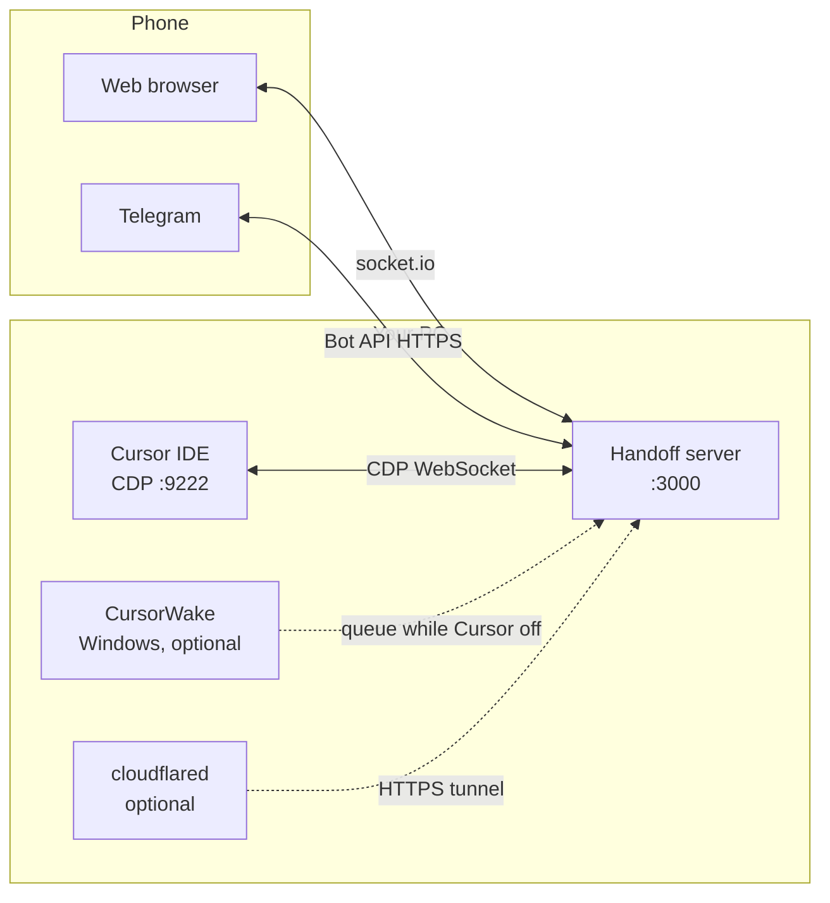
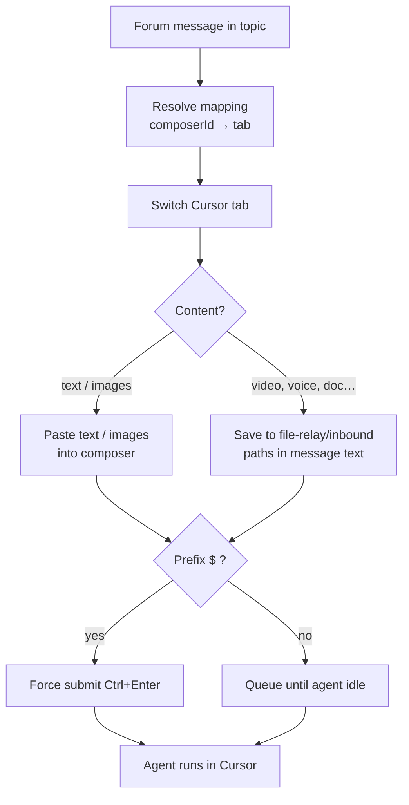
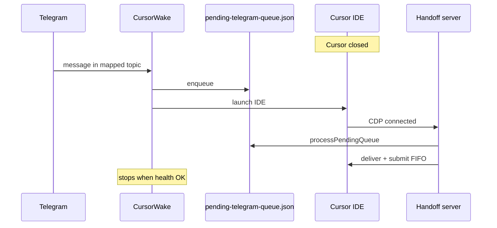
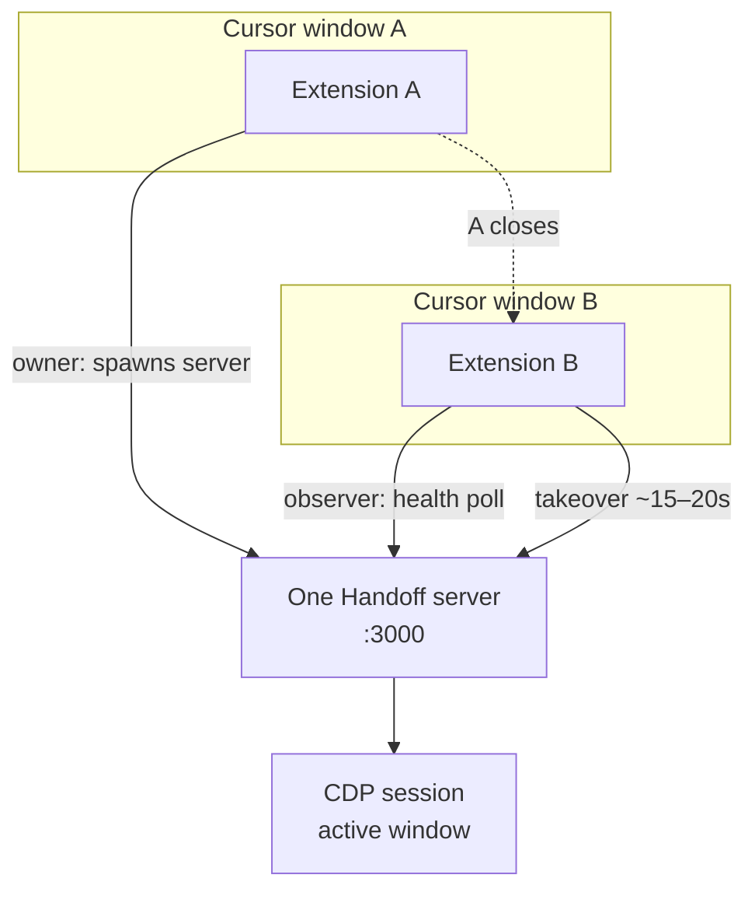

# Architecture

How CursorHandoff is put together — for contributors and curious maintainers. End-user setup lives in the [Getting started guide](guide.md); keys and paths in the [Settings reference](reference.md).

---

## System picture

Three runtimes, two outward bridges:



**Cursor** ships as Electron. Launch with `--remote-debugging-port=9222` and the server attaches over CDP — no patches to Cursor itself.

**Handoff server** is a Node bundle (`dist/server/bundle.mjs`). It normalizes IDE state, serves the static web client, and drives the Telegram bot.

**Phone browser** loads `src/client/` assets; realtime updates ride socket.io.

**CursorWake** (Windows tray) holds the Telegram long-poll while Cursor is down, writes to `pending-telegram-queue.json`, launches Cursor on inbound messages (or on a periodic timer when **Raise Cursor** is on), and yields the bot token when `/health` shows CDP + `connected: true` so Handoff can take over `getUpdates`.

---

## Server wiring

`src/core/main.ts` wires subsystems through EventEmitter subscriptions.

### IDE layer (`src/ide/`)

- **Session** — discover workbench targets on `:9222`, keep the WebSocket alive, hop between Cursor windows.
- **Parse** — `tabs.ts`, `messages.ts`, `composer.ts`, `plan-widget.ts` evaluate DOM via `Runtime.callFunction`, keyed on `[data-message-index]` (Cursor 3.8+).
- **Actions** — `navigation.ts`, `composer.ts`, `approval.ts`, `agent-controls.ts` turn remote intents into CDP input. The ProseMirror composer needs the Input domain; assigning `.value` on DOM nodes is not enough.

### State (`src/state/`)

- Diff successive `CursorState` snapshots, debounce ~300 ms, emit `state:patch`.
- **Window monitor** — background polls for inactive **project** windows (vscode workspace folder present; 5 s when active, 10 s when idle). Shells without a workspace (e.g. Cursor Agents) are skipped.
- **Hang monitor** — if one window stops responding while siblings are fine, `Target.closeTarget` on the stuck target.

### Web (`src/web/`)

- `/health` — always answers liveness; full payload only with a valid web session. Exposes `build.compatVersion`, `telegramPoll`, tunnel URL.
- Static assets, socket.io hub, auth gate when listening off-loopback without a password.

### Telegram (`src/telegram/`)

Pluggable transport via `TELEGRAM_IMPL` (default **`raw`**):

| `raw` | Native `fetch` long-poll + outbound client — bundled default |
| `grammy` | Grammy handlers; polling may still use native fetch in hybrid paths |

Shared loop: `transport/poll-loop.ts` — mappings, inbound routing, outbound diff/edit, send queue (~300 ms send / ~100 ms edit), slash commands, bridge commands.

**Inbound path:** forum message → resolve window/tab (`composerId` first) → switch tab → paste text/images or stage other files with paths → submit. Plain text in **# General** is not forwarded as an agent prompt (slash commands only).



**Outbound path:** per-window snapshots → HTML in `format/html.ts` → `editMessageText` with 4096-char chunking; approvals and plans get inline keyboards.

**Commands:** `commands/registry.ts` — bridge lifecycle (`/bridge`, `/bridge_all`, `/unbridge`, `/merge_threads`, `/flush`) plus chat and diagnostics helpers.

### Routing rules

Topic key: `windowTitle::tabTitle`, optionally scoped by `composerId`.

- **`composerId` beats title** when several tabs look alike (“New Chat”).
- **Outbound is window-local** — snapshots cannot post into another window’s thread.
- **`lastInboundAt`** picks the winner on ambiguous matches.
- Cursor’s unified agent UI may show multiple projects in one sidebar; extraction ties tabs to the window title ↔ project cell. An empty `composerId` must not scan the whole document for unrelated tabs.

User-facing probes: `/whereami`, `/thread_status` ([Telegram bridge guide](telegram.md)).

### Offline queue (`src/workspace/offline-queue.ts`)

Wake and the server coordinate through `pending-telegram-queue.json`. After CDP connect, the server calls `processPendingQueue()`. Queue v2 retains Telegram `file_id` for photos and documents (including video, voice, GIF); files are downloaded when the server is up.



### Media (`src/media/`)

- Inbound: `inbound/media-resolve.ts`, `inbound/photos.ts`, `clipboard-win.ts` — images via clipboard; video/voice/GIF/documents saved under `file-relay/` with paths in message text.
- Outbound: `outbox-watch.ts` watches `.cursor-handoff/outbox/`, splits photo vs document albums (≤10 each), sends after idle + debounce; purges stale outbox files after 1 h; `resolveOutboundTarget` uses workspace + `composerId` + `lastInboundAt`.
- Web: `inbound-images.ts` — same split for browser uploads (≤10 attachments, 20 MB Bot API cap).
- Redeploy: `flushOutboxForWorkspace` drains pending sends.

### compatVersion contract

Extension and server bundle must share the same **`compatVersion`** integer. Bump it in `scripts/build/compat-version.json` and `src/core/compat-version.ts` (`HANDOFF_COMPAT_VERSION`) when extension and `bundle.mjs` must ship together.

| Artifact | Role |
|----------|------|
| `scripts/build/compat-version.json` | Source of truth at build time |
| `dist/server/build-manifest.json` | Written by `scripts/build/write-build-manifest.mjs`; includes `compatVersion`, bundle SHA |
| `dist/compat-version.json` | Short stamp (`version` + `compatVersion`) for the extension pre-spawn gate |
| `GET /health` → `build.compatVersion` | Runtime check for web clients and smoke tests |

**Server:** `src/core/fingerprint.ts` runs a startup audit; success logs `BUILD OK compatVersion=1`. Mismatch violations use `compatVersion-mismatch`.

**Extension:** `extension/src/compat-version.ts` → `verifyBundleBeforeSpawn()` in `server-process.ts` blocks spawn when manifest, stamp, package version, or SHA disagree.

**Cursor upgrade:** {#cursor-upgrade} extension toast, Telegram # General, and web banner when running Cursor ≠ pinned `testedCursorVersion`. Fires after CDP is healthy on each server start; `<data-root>/cursor-upgrade-server-notify.json` dedupes redeploy within 120s (per server `pid` and channel). Web dismiss hides until the next notify wave (`cursorUpgradeServerNotifyAt` on `/health`).

### Logging (`src/core/log-visor.ts`, `log-event.ts`)

- Server disk: `handoff-server.log` — structured JSON or human lines with `code=` tails; secrets and home paths sanitized for UI surfaces.
- Extension: `handoff-ext.log` for extension-native events; child stdout uses a separate pipe (no TG duplicates on ext disk).
- **Visor** polls every 4 s, tail-merges server + ext + optional `cursor-wake.log` → `handoff.log` with `[server|ext|wake]` prefix and local timestamp before JSON.
- Sidebar **Handoff log** opens the merged file in the editor.

---

## VS Code extension (`extension/src/`)

Spawns `dist/server/bundle.mjs` as a child process — never imports server code.

| Module | Responsibility |
|--------|----------------|
| `extension.ts` | Activation, commands, auto-start, password generation |
| `server-process.ts` | Owner/observer singleton, health poll, takeover, `compatVersion` gate before spawn |
| `compat-version.ts` | `verifyBundleBeforeSpawn()` — manifest + `dist/compat-version.json` + package version |
| `cursor-upgrade-advisory.ts` | Publishes `cursor-host.json`; extension toast on server-ready health |
| `config-bridge.ts` | Settings → environment |
| `handoff-settings.ts` / `handoff-settings-view.ts` | Handoff settings webview |
| `log-event.ts` / `ext-disk-log.ts` / `output-channel.ts` | Extension logging; merged **Handoff log** UI |
| `ui-sidebar.ts` | Status tree; **Test CDP**, **Test Telegram bot**, **Restart server** |
| `wake-launcher.ts` | Start `CursorWake.exe` (Windows) |
| `tunnel-launcher.ts` | Spawn cloudflared quick tunnel (`scripts/tunnel/run-cloudflared-quick.ps1` or `.sh`) |
| `install-cloudflared.ts` | Install cloudflared (winget / Homebrew / GitHub binary to `~/.local/bin`) |

**Owner/observer:** the first window with a healthy CDP session spawns the server; if it exits, another window takes over after **~15–20 s** (health poll every 5 s; takeover after 3 failed polls + up to 3 s jitter).



Build pipeline: esbuild → `dist/extension.cjs` + `dist/server/bundle.mjs`; client assets copied to `dist/client/`.

---

## Failure modes

| Situation | Response |
|-----------|----------|
| CDP drops | Exponential backoff reconnect; clients show disconnected |
| Extraction returns null | Hold last good state; run `npm run discover` if persistent |
| Command error | Up to two retries |
| Telegram 409 | Only one poller per token; Wake yields on handoff; Handoff raw transport retries 409 during the race |
| Redeploy | Graceful shutdown; suppress false disconnect for ~90 s after startup |
| Hung window | Close one CDP target; notify the mapped thread |

---

## Repository map

```
src/
├── core/           entry, config, paths, log-visor, compatVersion audit (fingerprint.ts)
├── ide/            CDP session, parse/*, actions/*
├── state/          broadcast, window monitor, hang recovery
├── web/            routes, socket hub, tunnel, plans
├── telegram/       service, transport, commands, topics, format
├── media/          outbox watcher, lifecycle, inbound attachments
├── workspace/      offline queue, project dirs, launcher
├── client/         web UI
├── discovery/      DOM selector tool
└── i18n/           t.ts + locales/
extension/src/      VS Code extension host
wake/               CursorWake sources (Windows)
scripts/            build/, dev/, install/, release/, redeploy/, tunnel/
locales/            en.json, ru.json
data/               runtime (gitignored)
```

---

## External dependencies

Express, socket.io, `ws`, grammy, node-html-parser, mermaid (client bundle). No Puppeteer. CursorWake ships as Python sources built to `CursorWake.exe`.

---

## Implementation notes

- Tab switch: prefer `composerId`, then title.
- Mode/model menus: synthetic `.click()` — synthetic mouse events miss Cursor’s React controls.
- Web and Telegram formatters consume `codeBlocks` / `diffBlock`, not Monaco HTML dumps.
- Plan “View Plan” reads `~/.cursor/plans/<label>` through `src/web/plans.ts`.

Developer workflows: [Development guide](development.md) (build, logs, release).
