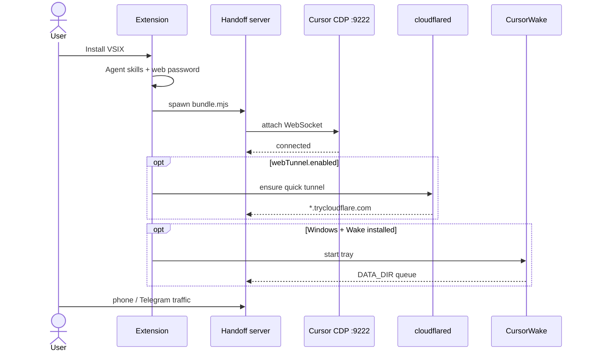
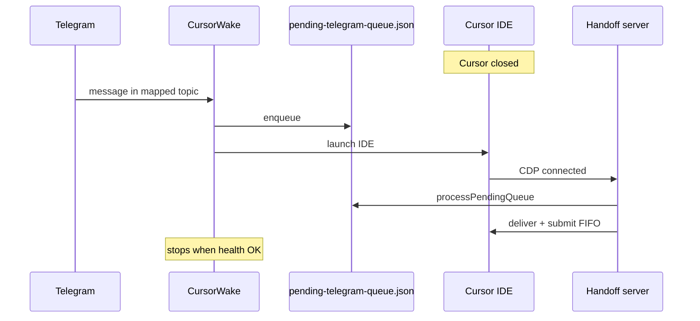
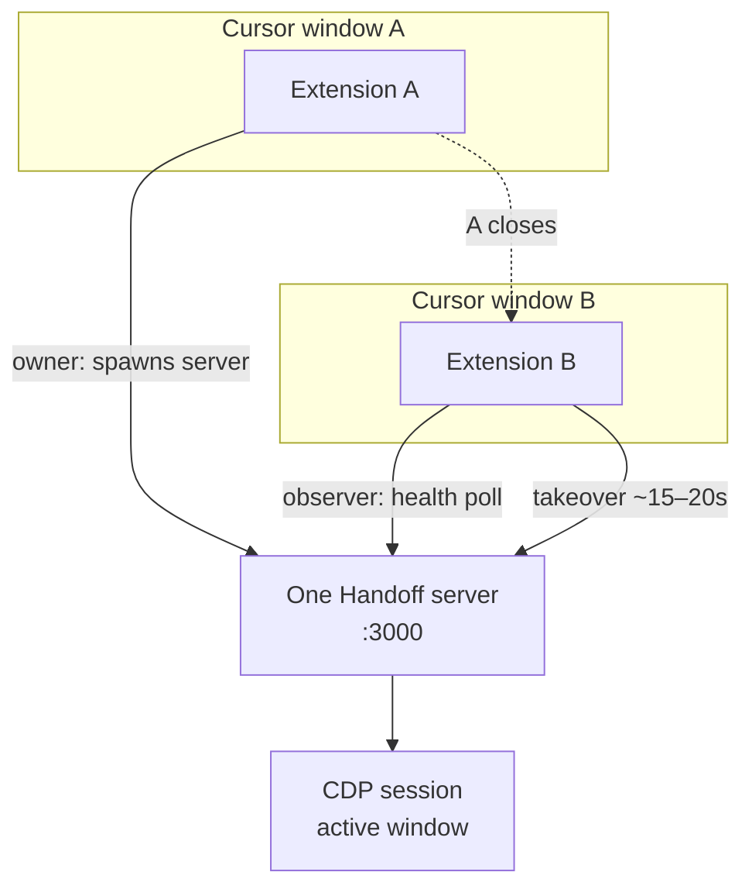

# Getting started

CursorHandoff sits between Cursor and your phone: a **local server** reads the IDE over Chrome DevTools Protocol (CDP), serves a mobile web UI, and can mirror chats into Telegram forum topics.

**Also read:** [Telegram bridge](telegram.md) · [Settings & paths](reference.md) · [Development](development.md) (build, logs, release)

---

<a id="enable-cdp"></a>

## Remote debugging in Cursor

The server talks to Cursor through CDP. Without a debugging port, nothing else works.

### Windows

Edit the Cursor shortcut: **Properties** → **Target** → append a space and `--remote-debugging-port=9222` → **OK**.

### macOS

```bash
open -a Cursor --args --remote-debugging-port=9222
```

### Linux

```bash
cursor --remote-debugging-port=9222
```

Quit Cursor completely and launch again (on macOS use **Cmd+Q**, not just close the window).

### Sanity check

Visit `http://localhost:9222/json`. You should see a JSON list of debug targets. An empty array means Cursor is still running without the flag.

---

## Install the extension

**Recommended:** download `cursor-handoff-1.2.0.vsix` from [GitHub Releases](https://github.com/W1ldGodlike/CursorHandoff/releases).

**From source:**

```bash
git clone https://github.com/W1ldGodlike/CursorHandoff.git
cd CursorHandoff
npm install
npm run package
```

Install the VSIX:

```bash
cursor --install-extension releases/cursor-handoff-1.2.0.vsix
```

Or **Extensions: Install from VSIX…** in the Command Palette.

When `cursorHandoff.autoStart` is true (default), the server starts with Cursor.

### First launch flow



### Activity bar sidebar

The **CursorHandoff** view shows version, server state (Running / Stopped / No CDP), CursorWake status (Windows), Cloudflare tunnel status, and controls to start or stop the server, **restart server** (owner), open the CDP workspace, switch agent mode, and inspect connected clients and windows.

Shortcuts: **Open Handoff settings**, **Open web client**, **Handoff log** (opens `<data-root>/handoff.log` — the server visor merges server, extension, and Wake lines every 4 seconds; the editor tab refreshes as the file grows).

Diagnostics (no server required): **Test CDP** (`/json` on `cdpUrl`) and **Test Telegram bot** (`getMe` with the saved token) — listed under **Handoff log**.

Palette commands include **Start/Stop/Restart server**, **Install CursorWake** (Windows), **Install cloudflared**, and **Install agent skills**.

---

## Handoff settings

Open with **CursorHandoff: Open Handoff settings**.

### Language

Pick English or Russian. This drives Handoff settings, the sidebar, status bar, web client, and Telegram strings (`cursorHandoff.locale`).

### Web access

Left nav: **Web access**. The link at the top is what you open on the phone — copy it after **Save and restart**.

| Bind | Binds to | When to use |
|------|----------|-------------|
| **Localhost** | `127.0.0.1` | Browser on this machine only |
| **LAN** | `0.0.0.0` | Phone on the same Wi‑Fi — **password required** |
| **Custom** | Your choice | Tailscale IP or another interface |

Set the **password** before LAN or Custom. Localhost does not need it.

The web password is generated on first install. Copy it from the panel or from Settings (`cursorHandoff.webappPassword`). On another device, open `http://<host>:3000` where `<host>` is your LAN or Tailscale address — not `127.0.0.1`.

### Telegram

Left nav: **Telegram**. Five numbered steps in the panel:

1. **Bot token** — create a bot with [@BotFather](https://t.me/BotFather), paste token, **Save token**
2. **Who may use the bot** — your numeric Telegram ID ([@userinfobot](https://t.me/userinfobot)), **Save**
3. **Telegram group** — supergroup with **Topics**, bot as admin
4. **Link this PC to the group** — server running → send `/register <token>` from the panel **in the group**
5. **Create chat topics** — in **# General**, send `/bridge` (active tabs) or `/bridge_all` (all tabs)

**Bot API transport** (Raw / Grammy) is at the bottom of the same tab. Default is **`raw`**. Details: [Telegram bridge guide](telegram.md).

### Add-ons

Left nav: **Add-ons**.

**CursorWake (Windows)** — tray app that holds Telegram traffic and can launch Cursor while it is closed. Install, pause/resume, restart, remove; toggle **Start Wake on Windows login**.

**Cloudflare quick tunnel** — temporary `*.trycloudflare.com` HTTPS link; **web password required**. Install cloudflared, start/stop tunnel, toggle **Start tunnel when server starts** (`cursorHandoff.webTunnel.enabled`). Post the URL with **`/web_url`** in Telegram **# General**.

---

## Web client

Open from the sidebar or at `http://<host>:3000`, then sign in with the web password.

The header status strip includes an **Access** chip: it shows how you reached this page (**Local**, **LAN**, **Tailscale**, **Cloudflare**, or **Direct**), based on the hostname in the browser address bar (for example `192.168.x.x` → LAN, `*.ts.net` or `100.64.x.x` → Tailscale, `*.trycloudflare.com` → Cloudflare).

You get a live chat feed, approval cards (optional approve sound in ⚙, default off), plan widgets, rendered code and diffs, and file attachments from the phone (images paste into the composer; other files land on disk and paths go in the message). Messages starting with `$` force-submit even when the agent is busy; other text queues until the agent is idle. Header **Mode** and **Model** pills open sheets that read the live Cursor menus over CDP (same lists as in the IDE — not a hardcoded catalog). Preferences sync to `<data-root>/web-settings.json`.

---

<a id="remote-access"></a>

## Reach the server from another device

Do not expose an unauthenticated server to the internet. Always set a **strong web password** before binding beyond localhost.

### Same Wi‑Fi (LAN)

Handoff settings → **Web access** → **LAN** → **Save and restart**. Allow inbound TCP **3000** in the host firewall if the phone cannot connect.

<a id="tailscale"></a>

### Tailscale

Tailscale gives each device a private address on a mesh VPN — no router port forwarding, works over cellular.

1. Install [Tailscale](https://tailscale.com/download) on the PC and phone under one account.
2. On the PC, run `tailscale ip -4` (example: `100.64.1.23`).
3. Handoff settings → **Web access** → **Custom** → paste the Tailscale IP → **Save and restart**.
4. On the phone (Tailscale connected): `http://100.64.1.23:3000`.

With MagicDNS you can use `http://my-desktop:3000`. For a temporary public HTTPS endpoint: `tailscale funnel 3000` — still require the web password.

**WSL2:** run Tailscale inside WSL, or use mirrored networking on the Windows host so the server binds where the phone can reach it.

<a id="cloudflare"></a>

### Cloudflare quick tunnel

cloudflared can publish a short-lived HTTPS URL (`*.trycloudflare.com`) so the phone needs no VPN.

1. Install cloudflared: **Handoff settings → Add-ons**, or manually:
   - Windows: `winget install Cloudflare.cloudflared`
   - macOS / Linux: `brew install cloudflared` (or let Handoff download to `~/.local/bin`)
2. Turn on **`cursorHandoff.webTunnel.enabled`** (default on) or enable autostart in Handoff settings.
3. Set a strong **webapp password**.
4. The active URL is written to `<data-root>/web-tunnel-url.json`; **`/web_url`** in Telegram # General posts the link.

Manual start/stop:

**Windows:**

```powershell
powershell -NoProfile -ExecutionPolicy Bypass -File scripts/tunnel/run-cloudflared-quick.ps1 -Action start
```

**macOS / Linux:**

```bash
bash scripts/tunnel/run-cloudflared-quick.sh -Action start -Port 3000
```

Quick tunnel URLs are **not a fixed domain** — Cloudflare assigns a random `*.trycloudflare.com` hostname when **that cloudflared process** starts. While the same `cloudflared` keeps running and `/health` on the saved URL still works, Handoff **reuses it** (`ensure` does not respawn cloudflared). A **new** link appears when cloudflared is stopped and started again (Handoff settings → Stop, crash, PC reboot, or `ensure` after the tunnel died). Restarting only the Handoff server or Cursor usually **does not** change the URL. For durable private access, prefer Tailscale.

Failed logins are capped at **10 attempts per minute per IP**.

---

<a id="cursor-wake"></a>

## CursorWake (Windows)

CursorWake is a tray app that keeps polling Telegram while Cursor is closed, queues inbound messages (including file attachments — same types as the live server), and launches Cursor when needed.



Install from Handoff settings → **Add-ons** → Wake, **CursorHandoff: Install CursorWake**, or:

```powershell
.\scripts\install\build-cursor-wake.ps1
.\scripts\install\install-handoff-wake.ps1
```

It reads the same `cursorHandoff.telegram.*` settings; state lives under the Handoff **data root** (see [Where data lives](../README.md#where-data-lives) — `<repo>/data/` in dev, VSIX install folder `/data` when another workspace is open, custom `cursorHandoff.dataDir`, or global storage fallback).

- Tray **Raise Cursor** — periodic autostart while Cursor is down (default every 5 min) plus **immediate** launch on Telegram messages.
- **`/pause`** and **`/resume`** mirror the tray checkbox.
- Log file: `<data-root>/cursor-wake.log` — lines include stable `code=WAKE_*` tails (e.g. `WAKE_LAUNCH_START`, `WAKE_HEALTH_ZOMBIE_PORT`). Grep: `rg "code=WAKE_" <data-root>/cursor-wake.log`.
- After changing Wake Python sources, rebuild before the tray picks up new logging: `.\scripts\install\build-cursor-wake.ps1` (Complete VSIX bundles the fresh exe).

---

## Multiple Cursor windows

One server process per machine. The first healthy window **owns** it; other windows **observe** via health polling (5 s). If the owner closes, an observer takes over after **~15–20 s** (three failed health polls + up to 3 s jitter).



---

<a id="diagnostics-and-logs"></a>

## Diagnostics and logs

### Sidebar probes

Under **Handoff log** in the activity bar:

| Action | What it checks |
|--------|----------------|
| **Test CDP** | `GET` on `cursorHandoff.cdpUrl` `/json` — server need not be running |
| **Test Telegram bot** | Bot API `getMe` with the saved token |
| **Restart server** | Owner only — stop then start the Handoff child |

### Handoff log (merged)

The server **visor** (`src/core/log-visor.ts`) tail-merges three sources into `<data-root>/handoff.log` every **4 seconds**:

| Source file | Line prefix |
|-------------|-------------|
| `handoff-server.log` | `[server]` |
| `handoff-ext.log` | `[ext]` |
| `cursor-wake.log` (when Wake runs) | `[wake]` |

Each merged line: `[component] DD.MM.YYYY HH:mm:ss:SSS {json}` (`ts` unix ms inside JSON). Structured lines use stable `code=` tails (`TG_*`, `CDP_*`, `WAKE_*`, …).

Sidebar **Handoff log** opens the merged file in the editor (scroll to end). Cursor reloads the tab as the visor appends. Raw files stay on disk for `rg`.

The extension Output channel still mirrors child-process stdout during development; prefer **Handoff log** for support.

### Cursor upgrade advisory

When running Cursor ≠ `testedCursorVersion` (pinned at `npm run package`):

- Extension toast after CDP is healthy
- Telegram post in **# General**
- Dismissible web banner (`cursorUpgradeServerNotifyAt` on `/health`)

Dedup: `<data-root>/cursor-upgrade-server-notify.json`. Details: [Development — Upgrade advisory](development.md#upgrade-advisory).

---

## Appendix: run without the extension

Contributors and headless setups can run the same server bundle directly — no VS Code host, no Handoff settings UI.

```bash
git clone https://github.com/W1ldGodlike/CursorHandoff.git
cd CursorHandoff
npm install
cp .env.example .env
# Set TELEGRAM_ENABLED, TELEGRAM_BOT_TOKEN, …
npm run dev
```

| | Extension (normal) | Standalone |
|---|-------------------|------------|
| Configuration | Settings + Handoff settings | `.env` |
| Process | Extension spawns `dist/server/bundle.mjs` | `npm run dev` / `npm start` |
| Handoff settings | Handoff settings webview | None |

Environment variables: [Settings reference](reference.md). Telegram after `.env`: [Telegram bridge guide](telegram.md).

Production build: `npm run build && npm start` · server log: `<data-root>/handoff-server.log` · merged (visor): `<data-root>/handoff.log` · extension: `<data-root>/handoff-ext.log`

---

<a id="appendix-common-blockers"></a>

## Appendix: common blockers

| Symptom | First place to look |
|---------|---------------------|
| Web UI shows disconnected | `GET /health` — `connected`, `extractorStatus`; macOS backgrounding can stale CDP |
| Phone cannot open `:3000` | Firewall, bind still on `127.0.0.1`, WSL port forwarding |
| Sidebar empty or “No CDP” | `localhost:9222/json`; **Test CDP** in sidebar; restart server |
| Telegram bot quiet | **Test Telegram bot** in sidebar; [Telegram guide](telegram.md#bot-wont-connect) |
| Logs / error codes | Sidebar **Handoff log** → `<data-root>/handoff.log`; grep `handoff-server.log`, `cursor-wake.log` |
