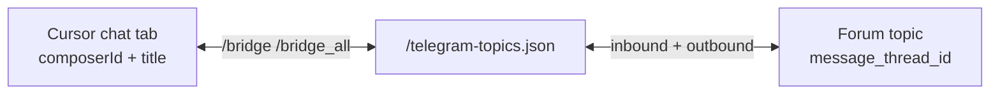
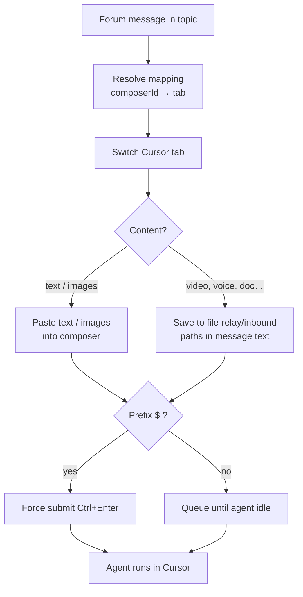

# Telegram bridge

Mirror Cursor chat tabs into forum topics of a Telegram supergroup: notifications on your phone, slash commands, inbound files, and outbound files from the agent workspace.

Installation and networking: [Getting started guide](guide.md). Keys, files on disk: [Settings reference](reference.md).

---

## What the bridge does

- Creates one **forum topic per Cursor chat tab** after you run `/bridge`
- Streams agent activity and messages to your phone
- Exposes slash commands (native Telegram `/` hints via `setMyCommands`)
- Accepts files in project threads (photos, documents, video, voice, GIF, stickers); sends files the agent drops in `.cursor-handoff/outbox/`
- On Windows, works with **CursorWake** to queue traffic while Cursor is off

### Topic mapping



---

## Prerequisites

Before opening Handoff settings **Telegram** tab:

- Supergroup with **Topics** turned on
- Bot added as admin with **Manage Topics**, **Delete Messages**, **Pin Messages**
- **Group Privacy** disabled for the bot ([@BotFather](https://t.me/BotFather) → Bot Settings → Group Privacy → Turn off)
- Your numeric Telegram user ID (panel step 2, or [@userinfobot](https://t.me/userinfobot))

---

<a id="five-step-setup"></a>

## Five-step setup (Handoff settings)

**CursorHandoff: Open Handoff settings** → **Telegram**.

**1 — Bot token**  
In Telegram, open [@BotFather](https://t.me/BotFather), send `/newbot`, follow the prompts, copy the token. Paste in the panel, **Save token**.

**2 — Who may use the bot**  
Message [@userinfobot](https://t.me/userinfobot) for your numeric ID. Paste below, comma-separate several IDs if needed, **Save**.  
Setting: `cursorHandoff.telegram.allowedUsers`. When non-empty, only those IDs can use the bot (open registration is ignored).

**3 — Telegram group**  
Create a group, enable **Topics** (supergroup), add the bot as administrator with **Manage Topics**, **Delete messages**, and **Pin messages**.

**4 — Link this PC to the group**  
With the server **Running**, copy `/register <token>` from step 4 in the panel and send it **in the group** (any topic). Registered users appear in the panel. Tokens: `<data-root>/telegram-auth.json`.

**5 — Create chat topics**  
Open **# General** in the group (not a project thread). Send **`/bridge`** to create topics for active Cursor tabs with messages. **`/bridge_all`** covers every open tab.

### Bot API transport

At the bottom of the **Telegram** tab (**Bot API transport**):

| Engine | Notes |
|--------|-------|
| **Raw** (default) | Direct `fetch` long-poll against the Bot API — what the bundled server expects |
| **Grammy** | Alternate stack with Grammy handlers; only if you deliberately need it |

Canonical default: **`raw`** (`cursorHandoff.telegram.impl`). **Save transport and restart** after switching.

Turn the feature on with `cursorHandoff.telegram.enabled` = true, or `TELEGRAM_ENABLED=true` in standalone `.env`.

---

## Everyday use

### Inbound messages

Messages route to the mapped Cursor tab: switch if needed, deliver content (paste or file paths), send.



- Leading **`$`** → force submit (Ctrl+Enter), even when the agent is working
- No prefix → waits in queue while the agent is busy

### AskQuestion / questionnaires

When the agent shows an **AskQuestion** panel in Cursor, Handoff mirrors it as **one inline message** in the mapped forum thread (A/B/C buttons plus **Other** when Cursor exposes a freeform row).

| You do in Telegram | What happens |
|--------------------|----------------|
| Tap **A / B / C** | Clicks the matching option in Cursor |
| Tap **Other** | Bot posts a **ForceReply** hint — **reply to that bot message** with your text |
| Reply with freeform text | Text goes into the **survey textarea**, not the main composer prompt |
| Send text without Reply while Other is pending | Bot nudges you to use Reply |
| **Skip** / **Continue** | Clicks the matching toolbar control when Cursor enables it |

**Multi-step surveys:** after a non-final **Other** answer, Handoff confirms the textarea and opens the next stepper question. **Continue** is only for submitting the full survey when Cursor enables it — not for moving one question at a time.

**Do not** send ordinary prompts in the same thread while a questionnaire is open — unrelated text is treated as a normal inbound message and can dismiss the survey widget.

### Tool approvals (Run / Confirm search / Delete)

When the agent waits for approval (`waiting_approval`), Handoff posts inline buttons on the matching feed message (web and Telegram use the same CDP click paths):

| Card | Buttons | Notes |
|------|---------|-------|
| Shell | **Run** / **Skip** ( **Allow** when present) | From `pendingApprovals` DOM scan |
| Confirm search | **Continue** / **Cancel** / **Auto-search web** | Scoped per search query when several cards are open |
| Delete file | **Accept** / **Reject** | Scoped per filename; buttons clear after accept or when the card leaves pending |
| Generate image | **Run** / **Skip** | Prompt on the feed message; scoped per `toolCallId` |

**Generated image previews:** completed **Generated image** tools get sidecars under `<data-root>/feed-images/` (same CDP collect as web). The web client shows inline previews (`GET /api/feed-image/:id`). Telegram posts the tool line in HTML, then **`sendPhoto` / `sendDocument` / album** for ready sidecars on the next poll (`feed-image-outbound.ts`; dedup `feed-img:{composerId}:{sidecarId}`). Not the same as [file relay](#file-relay) outbox — automatic on agent generation only.

Tap a button → CDP clicks the matching control in Cursor → cards refresh on the next state poll.


In a **project thread**:

| You send | What Handoff does |
|----------|-------------------|
| Photo or image document (JPEG, PNG, WebP) | Clipboard paste into the composer |
| Video, voice, audio, GIF (animation), sticker, other documents | Saved under `.cursor-handoff/file-relay/inbound/`; file paths added to the message text |
| Contact, location, poll, dice, game | Reply: type not supported (EN/RU) |

**Caption or follow-up text:** a file without a caption waits up to ~10 minutes for the next message in the same thread. Albums are debounced (~2 s); the first caption in a group is kept.

**Size:** up to **20 MB** per file — Telegram Bot API `getFile` limit (not a Handoff cap).

**CursorWake:** while Cursor is off, the same attachment types are queued in `<data-root>/pending-telegram-queue.json` and delivered after connect.

---

## Commands

Registered for the BotFather menu (`src/telegram/commands/registry.ts`):

| Command | What it does |
|---------|----------------|
| `/register` | Pair the group: `/register <token>` |
| `/bridge` | Link active Cursor tabs to forum threads |
| `/bridge_all` | Topics for all tabs and windows |
| `/unbridge` | Disable bridge and remove topics |
| `/merge_threads` | List duplicate threads; `/merge_threads yes` to merge |
| `/flush` | Delete all topics (full reset) |
| `/close_chat` | Close the Cursor chat tab |
| `/close_project` | Close the Cursor project window (thread mapping stays) |
| `/new_chat` | New Cursor chat + new Telegram thread |
| `/status` | Connection and bridge status |
| `/set_mode` | Agent mode picker (dynamic list from CDP) |
| `/pick_model` | Model picker (inline buttons; Auto on → run `/auto_off` first) |
| `/auto_off` | Turn off model Auto in Cursor (then `/pick_model`) |
| `/auto_on` | Turn on model Auto in Cursor |
| `/pause` | Pause CursorWake |
| `/resume` | Resume CursorWake |
| `/open_project` | Open a project by name fragment or full path |
| `/projects` | Pick a project to open (inline buttons) |
| `/web_url` | HTTPS link to the web client (# General) |
| `/setup_tg_send` | Enable file relay for this workspace |
| `/thread_status` | Poll, agent state, composer queue length, pending approve count |
| `/last_commit` | Latest git commit (hash + subject) for the thread workspace |
| `/whereami` | Window, composer, and tab routing |
| `/notify_mode` | Notification level: full / quiet / final |

**Stable bridge surface (1.0.0):** `/bridge`, `/bridge_all`, `/unbridge`, `/merge_threads`, `/flush`.

### Mode and model (project thread)

Run these in a **linked project thread**, not in # General. The bot switches to the mapped Cursor window/tab first.

| Goal | What to do |
|------|------------|
| Change agent mode (Plan, Agent, …) | `/set_mode` → tap an inline button |
| Pick a specific model | `/auto_off`, then `/pick_model` → tap a model button |
| Let Cursor choose the model (Auto) | `/auto_on` |

When **Auto** is on in Cursor, the IDE hides the model list — `/pick_model` only hints to run `/auto_off` first. `/auto_off` and `/auto_on` use the same CDP toggle as the web client **Model** sheet.

### Close project window (project thread)

Run **`/close_project`** in a **linked project thread**, not in # General.

| What happens | Detail |
|--------------|--------|
| Cursor | Only that project's window closes (`CDP /json/close/<targetId>`) |
| Telegram | Same forum thread stays; mapping in `telegram-topics.json` is kept |
| Reopen | Send a message in that thread (or `/open_project` from # General) — Handoff opens the project again from the stored path; if Cursor was fully closed, [CursorWake](guide.md#cursor-wake) may start the IDE first ([who opens what](guide.md#opening-projects-from-telegram)) |
| # General | No disconnect spam — intentional window close is not treated as a lost IDE connection |

Success reply is localized (`tg.msg.closeProject.ok`). On failure you get `tg.msg.closeProject.failed` (for example CDP close HTTP error).

### Open a project (# General)

Run these in **# General**, not in a bridged project thread.

| Command | What it does |
|---------|----------------|
| `/projects` | Inline buttons — open a project (smart tab/topic reconcile; see below) |
| `/open_project <fragment>` | Open by folder name match; several hits → pick buttons |
| `/open_project <full path>` | Open an absolute path when it exists on disk |

**Where names come from:** open Cursor windows (CDP `workspacePath`), Cursor’s recent-folder list (`%APPDATA%/Cursor/User/globalStorage/storage.json` on Windows), and workspaces already bridged in `telegram-topics.json`. Handoff does **not** scan `~/Projects` or the whole home directory.

`/open_project` with no argument prints usage. Pick buttons expire after 10 minutes — run `/projects` or `/open_project` again.

**Requires a running Handoff server** (at least one open Cursor window with the extension). CursorWake is **not** required when Cursor is already open. See [Who opens what from Telegram](guide.md#opening-projects-from-telegram) for Wake vs server vs extension.

**Already open:** if the project window is already running, Handoff **switches** to it instead of spawning another folder open. Same logic from the [web project picker](guide.md#projects-from-the-web-client) (`command:open_project`).

**Smart open (closed window):** after launch, ~10 s settle, then: Cursor tab + **alive** TG topic (probed, not JSON-only) → reuse both; tab but dead/missing topic → **new topic** on that tab; no tabs → `newChat` + new topic. Writing in an **existing project thread** still reopens via `resolveTargetWindow` without duplicating chats.

**Close from web or TG:** `close_project` clears the window-monitor snapshot and refreshes CDP targets so the list does not show stale **open** rows.

### Web client (same project list)

The mobile web UI uses the same folder list and `src/workspace/project-web.ts` helpers:

| UI | Socket event |
|----|----------------|
| Header **Project** or **⋮ → Open project** | `command:list_projects` (ack with `projects[]`) |
| Tap a row | `command:open_project` + `projectPath` |
| **Close** on an open row | `command:close_project` + `projectPath` |

See [Projects from the web client](guide.md#projects-from-the-web-client).

---

## How routing works

Each mapping ties a forum `message_thread_id` to a Cursor window/tab key: `windowTitle::tabTitle`, optionally refined by `composerId`.

- When several tabs share a title, **`composerId` wins**
- Outbound updates stay **per window** — one window cannot hijack another’s thread
- **`lastInboundAt`** breaks ties when multiple mappings could match

Use **`/whereami`** and **`/thread_status`** in a thread when debugging.

Wrong thread? Try `/unbridge` then `/bridge`, or `/flush` for a clean slate.

### Multi-window warnings (`GHOST_SKIP`, `ROUTE_MISS`)

When **several Cursor project windows** are open, logs may show:

| Code | Meaning |
|------|---------|
| `TG_OUTBOUND_ROUTE_MISS` | This window/tab has no forum thread mapping yet (or the tab title changed). |
| `TG_OUTBOUND_GHOST_SKIP` | This tab’s `composerId` is **already owned** by another window’s mapping — outbound to Telegram is skipped so thread A does not get thread B’s replies. |

This is **not** a crash. Typical after opening/switching projects from web or `/open_project`: CursorHandoff still works in the active window; a Velorix reply will not mirror into a CursorHandoff thread until mappings match the active tab (`/whereami`, `/bridge`, or write in the correct project thread).

---

## File relay

### Cursor → Telegram

**Agent-generated images:** when the agent completes a **Generated image** tool row, Handoff uploads the sidecar from `<data-root>/feed-images/` with `sendPhoto` (automatic — no outbox skill). The HTML tool line still posts as usual.

**Manual file relay** (screenshots, exports, anything the agent copies for you):

1. In the project thread, run **`/setup_tg_send`** once per workspace.
2. Ask the agent to place deliverables only in **`.cursor-handoff/outbox/`** (short Latin filenames). **Copy** files in — do not move; outbox TTL is 1 hour by file `mtime`.
3. The bot sends after `agentStatus` is idle or error, plus ~2 s debounce. Mixed photos and documents are split into separate Telegram albums (≤10 each).

Optional: install the global skill `cursor-handoff-telegram-send` via **CursorHandoff: Install agent skills**.

### Telegram → Cursor

See [Files and media](#files-and-media) above. Image staging: `.cursor-handoff/file-relay/photo/inbound/`. Other files: `.cursor-handoff/file-relay/inbound/`.

### Web client

Same rules as Telegram: up to **10** attachments per message; JPEG/PNG/WebP paste into the composer; other files → `file-relay/inbound` + paths in the message. Max **20 MB** per file.

### Limits

- Outbound only from the configured outbox per project
- Outbound: homogeneous albums only — up to 10 **photos** or 10 **documents** per group; mixed types and large batches are split automatically
- Inbound: images paste; other files use paths in message text
- Outbox stale files removed after **1 hour** (workspace `.cursor-handoff/outbox/`)

---

## Handoff with CursorWake

Telegram allows **one** long-polling client per bot token.

1. While Cursor is off, CursorWake polls and appends to `pending-telegram-queue.json`. Inbound messages launch the **Cursor app** immediately (when **Raise Cursor** is on) — not a specific project folder; see [Who opens what from Telegram](guide.md#opening-projects-from-telegram).
2. When `/health` reports CDP + `connected: true`, Wake stops polling so Handoff can own `getUpdates` (`telegramPoll` becomes true after the first successful server poll).
3. The server drains the queue and opens the mapped project window when needed (`open-project.json` → extension).

While Cursor stays off with an empty queue, Wake retries launch every **`autostartIntervalSec`** (default **300** = 5 min) if **Raise Cursor** is enabled.

**`/pause`** / **`/resume`** (or the tray checkbox) control whether Wake launches Cursor on new messages.

---

<a id="bot-wont-connect"></a>

## If the bot won't connect

Work top to bottom.

### 1. Health endpoint

```powershell
curl -s http://127.0.0.1:3000/health
```

Expect `connected`, and when Telegram is on: `telegramEnabled`, `telegramPoll`, `build.compatVersion: 1`.

### 2. Read the server log

| Line | Interpretation |
|------|----------------|
| `[telegram] API reachable — bot: @yourbot` | Token OK, API reachable |
| `[telegram] Bot connected (sync: on/off)` | Transport started |
| `[telegram] Long-poll established` | First `getUpdates` succeeded → `telegramPoll: true` |
| `[telegram] Using raw Bot API transport` | Raw engine active (default) |
| `[telegram] bot.init() failed: timed out after 15s` | Grammy `getMe` hung — switch to **Raw** |
| `[telegram] 409 Conflict — another bot instance…` | Two processes share the token |
| `[telegram] Invalid bot token (401 Unauthorized)` | Token wrong or revoked |

### 3. Token problems

Regenerate at [@BotFather](https://t.me/BotFather), update Handoff settings or `cursorHandoff.telegram.botToken`, restart the server.

### 4. HTTP 409 (duplicate poller)

Only one long-poll per token.

- Kill extra CursorHandoff or `node` processes
- With **CursorWake**, Wake yields the token when Handoff is healthy (`connected` + CDP); brief 409 lines during handoff are normal — Handoff retries
- After a crash, wait 30–60 s before restarting

### 5. Bot never reaches “connected”

If logs stop before “Bot connected” or “Long-poll established”: Handoff settings → **Telegram** → **Bot API transport** → **Raw** → **Save transport and restart** (default is already `raw`).

### 6. Bridge and topics

| Problem | Likely fix |
|---------|------------|
| `/bridge` sees no tabs | CDP connected? Chat tabs visible in Cursor? |
| Cannot create topic | Bot is admin with **Manage Topics** |
| Duplicate threads | `/merge_threads` then `/merge_threads yes` |
| `/new_chat` missing thread | Stale mapping — `/unbridge` + `/bridge` or `/flush` |

### 7. Outbox not delivering

- Ran `/setup_tg_send` in this project’s thread?
- File under `.cursor-handoff/outbox/`?
- Agent finished the iteration? (send waits for idle; blocked during `waiting_approval`)
- Mixed photo + document in one drop? (sent as separate albums — should still deliver)
- File older than 1 h in outbox? (TTL purge — copy fresh files in)
- Extension Output for `[outbox]` warnings

### 8. Network to Telegram

```powershell
curl https://api.telegram.org/bot<TOKEN>/getMe
```

VPN or corporate proxy may block `api.telegram.org`.

### 9. Brief “Disconnected” after redeploy

An old process can flash disconnect during restart. Current builds suppress that noise for graceful shutdown.

---

## On-disk data

Topic maps, auth, sync state, and the offline queue: [Settings reference — Storage](reference.md#storage).
