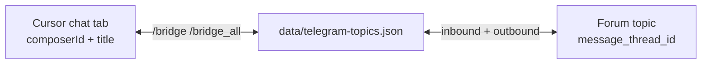
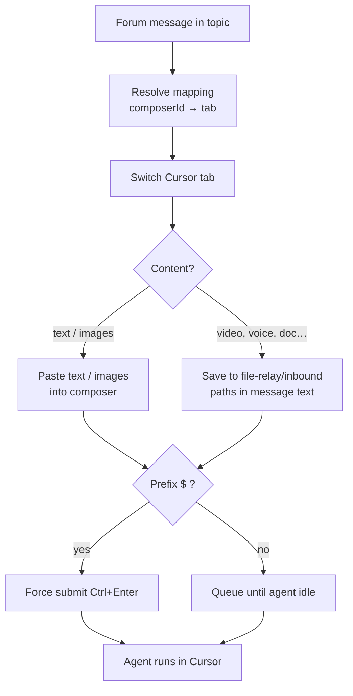

# Telegram bridge

Mirror Cursor chat tabs into forum topics of a Telegram supergroup: notifications on your phone, slash commands, inbound files, and outbound files from the agent workspace.

Installation and networking: [Getting started guide](guide.md). Keys, files on disk: [Settings reference](reference.md).

---

## What the bridge does

- Creates one **forum topic per Cursor chat tab** after you run `/bridge`
- Streams agent activity and messages to your phone
- Exposes slash commands and reply-keyboard shortcuts
- Accepts files in project threads (photos, documents, video, voice, GIF, stickers); sends files the agent drops in `.cursor-handoff/outbox/`
- On Windows, works with **CursorWake** to queue traffic while Cursor is off

### Topic mapping



---

## Prerequisites

Before opening Handoff settings **Telegram** tab:

- Supergroup with **Topics** turned on
- Bot added as admin with **Manage Topics**, **Delete Messages**, **Pin Messages**
- **Group Privacy** disabled for the bot ([@BotFather](https://t.me/BotFather) → Bot Settings → Group Privacy → Turn off)
- Your numeric Telegram user ID (panel step 2, or [@userinfobot](https://t.me/userinfobot))

---

<a id="five-step-setup"></a>

## Five-step setup (Handoff settings)

**CursorHandoff: Open Handoff settings** → **Telegram**.

**1 — Bot token**  
In Telegram, open [@BotFather](https://t.me/BotFather), send `/newbot`, follow the prompts, copy the token. Paste in the panel, **Save token**.

**2 — Who may use the bot**  
Message [@userinfobot](https://t.me/userinfobot) for your numeric ID. Paste below, comma-separate several IDs if needed, **Save**.  
Setting: `cursorHandoff.telegram.allowedUsers`. When non-empty, only those IDs can use the bot (open registration is ignored).

**3 — Telegram group**  
Create a group, enable **Topics** (supergroup), add the bot as administrator with **Manage Topics**, **Delete messages**, and **Pin messages**.

**4 — Link this PC to the group**  
With the server **Running**, copy `/register <token>` from step 4 in the panel and send it **in the group** (any topic). Registered users appear in the panel. Tokens: `data/telegram-auth.json`.

**5 — Create chat topics**  
Open **# General** in the group (not a project thread). Send **`/bridge`** to create topics for active Cursor tabs with messages. **`/bridge_all`** covers every open tab.

### Bot API transport

At the bottom of the **Telegram** tab (**Bot API transport**):

| Engine | Notes |
|--------|-------|
| **Raw** (default) | Direct `fetch` long-poll against the Bot API — what the bundled server expects |
| **Grammy** | Alternate stack with Grammy handlers; only if you deliberately need it |

Canonical default: **`raw`** (`cursorHandoff.telegram.impl`). **Save transport and restart** after switching.

Turn the feature on with `cursorHandoff.telegram.enabled` = true, or `TELEGRAM_ENABLED=true` in standalone `.env`.

---

## Everyday use

### Inbound messages

Messages route to the mapped Cursor tab: switch if needed, deliver content (paste or file paths), send.



- Leading **`$`** → force submit (Ctrl+Enter), even when the agent is working
- No prefix → waits in queue while the agent is busy

### Files and media

In a **project thread**:

| You send | What Handoff does |
|----------|-------------------|
| Photo or image document (JPEG, PNG, WebP) | Clipboard paste into the composer |
| Video, voice, audio, GIF (animation), sticker, other documents | Saved under `.cursor-handoff/file-relay/inbound/`; file paths added to the message text |
| Contact, location, poll, dice, game | Reply: type not supported (EN/RU) |

**Caption or follow-up text:** a file without a caption waits up to ~10 minutes for the next message in the same thread. Albums are debounced (~2 s); the first caption in a group is kept.

**Size:** up to **20 MB** per file — Telegram Bot API `getFile` limit (not a Handoff cap).

**CursorWake:** while Cursor is off, the same attachment types are queued in `pending-telegram-queue.json` and delivered after connect.

### Reply keyboards

Tiles in **# General** and project threads execute slash commands locally. They are **not** forwarded as agent prompts.

---

## Commands

Registered for the BotFather menu (`src/telegram/commands/registry.ts`):

| Command | What it does |
|---------|----------------|
| `/register` | Pair the group: `/register <token>` |
| `/bridge` | Link active Cursor tabs to forum threads |
| `/bridge_all` | Topics for all tabs and windows |
| `/unbridge` | Disable bridge and remove topics |
| `/merge_threads` | List duplicate threads; `/merge_threads yes` to merge |
| `/flush` | Delete all topics (full reset) |
| `/close_chat` | Close the Cursor chat tab |
| `/new_chat` | New Cursor chat + new Telegram thread |
| `/status` | Connection and bridge status |
| `/set_mode` | Agent mode (Plan / Agent) |
| `/pick_model` | Model picker (inline buttons) |
| `/pause` | Pause CursorWake |
| `/resume` | Resume CursorWake |
| `/menu` | Show command tiles |
| `/open_project` | Open a project by name |
| `/projects` | List names for `/open_project` |
| `/web_url` | HTTPS link to the web client (# General) |
| `/setup_tg_send` | Enable file relay for this workspace |
| `/thread_status` | Poll, agent, and queue state |
| `/whereami` | Window, composer, and tab routing |
| `/thread_rename` | Rename the thread for the current task |
| `/notify_mode` | Notification level: full / quiet / final |

**Stable bridge surface (1.0.0):** `/bridge`, `/bridge_all`, `/unbridge`, `/merge_threads`, `/flush`.

---

## How routing works

Each mapping ties a forum `message_thread_id` to a Cursor window/tab key: `windowTitle::tabTitle`, optionally refined by `composerId`.

- When several tabs share a title, **`composerId` wins**
- Outbound updates stay **per window** — one window cannot hijack another’s thread
- **`lastInboundAt`** breaks ties when multiple mappings could match

Use **`/whereami`** and **`/thread_status`** in a thread when debugging.

Wrong thread? Try `/unbridge` then `/bridge`, or `/flush` for a clean slate.

---

## File relay

### Cursor → Telegram

1. In the project thread, run **`/setup_tg_send`** once per workspace.
2. Ask the agent to place deliverables only in **`.cursor-handoff/outbox/`** (short Latin filenames). **Copy** files in — do not move; outbox TTL is 1 hour by file `mtime`.
3. The bot sends after `agentStatus` is idle or error, plus ~2 s debounce. Mixed photos and documents are split into separate Telegram albums (≤10 each).

Optional: install the global skill `cursor-handoff-telegram-send` via **CursorHandoff: Install agent skills**.

### Telegram → Cursor

See [Files and media](#files-and-media) above. Image staging: `.cursor-handoff/file-relay/photo/inbound/`. Other files: `.cursor-handoff/file-relay/inbound/`.

### Web client

Same rules as Telegram: up to **10** attachments per message; JPEG/PNG/WebP paste into the composer; other files → `file-relay/inbound` + paths in the message. Max **20 MB** per file.

### Limits

- Outbound only from the configured outbox per project
- Outbound: homogeneous albums only — up to 10 **photos** or 10 **documents** per group; mixed types and large batches are split automatically
- Inbound: images paste; other files use paths in message text
- Outbox stale files removed after **1 hour** (workspace `.cursor-handoff/outbox/`)

---

## Handoff with CursorWake

Telegram allows **one** long-polling client per bot token.

1. While Cursor is off, CursorWake polls and appends to `pending-telegram-queue.json`. Inbound messages launch Cursor **immediately** (when **Raise Cursor** is on).
2. When `/health` reports CDP + `connected: true`, Wake stops polling so Handoff can own `getUpdates` (`telegramPoll` becomes true after the first successful server poll).
3. The server drains the queue.

While Cursor stays off with an empty queue, Wake retries launch every **`autostartIntervalSec`** (default **300** = 5 min) if **Raise Cursor** is enabled.

**`/pause`** / **`/resume`** (or the tray checkbox) control whether Wake launches Cursor on new messages.

Scenarios: [Development guide](development.md).

---

<a id="bot-wont-connect"></a>

## If the bot won't connect

Work top to bottom.

### 1. Health endpoint

```powershell
curl -s http://127.0.0.1:3000/health
```

Expect `connected`, and when Telegram is on: `telegramEnabled`, `telegramPoll`, `build.compatVersion: 1`.

### 2. Read the server log

| Line | Interpretation |
|------|----------------|
| `[telegram] API reachable — bot: @yourbot` | Token OK, API reachable |
| `[telegram] Bot connected (sync: on/off)` | Transport started |
| `[telegram] Long-poll established` | First `getUpdates` succeeded → `telegramPoll: true` |
| `[telegram] Using raw Bot API transport` | Raw engine active (default) |
| `[telegram] bot.init() failed: timed out after 15s` | Grammy `getMe` hung — switch to **Raw** |
| `[telegram] 409 Conflict — another bot instance…` | Two processes share the token |
| `[telegram] Invalid bot token (401 Unauthorized)` | Token wrong or revoked |

### 3. Token problems

Regenerate at [@BotFather](https://t.me/BotFather), update Handoff settings or `cursorHandoff.telegram.botToken`, restart the server.

### 4. HTTP 409 (duplicate poller)

Only one long-poll per token.

- Kill extra CursorHandoff or `node` processes
- With **CursorWake**, Wake yields the token when Handoff is healthy (`connected` + CDP); brief 409 lines during handoff are normal — Handoff retries
- After a crash, wait 30–60 s before restarting

### 5. Bot never reaches “connected”

If logs stop before “Bot connected” or “Long-poll established”: Handoff settings → **Telegram** → **Bot API transport** → **Raw** → **Save transport and restart** (default is already `raw`).

### 6. Bridge and topics

| Problem | Likely fix |
|---------|------------|
| `/bridge` sees no tabs | CDP connected? Chat tabs visible in Cursor? |
| Cannot create topic | Bot is admin with **Manage Topics** |
| Duplicate threads | `/merge_threads` then `/merge_threads yes` |
| `/new_chat` missing thread | Stale mapping — `/unbridge` + `/bridge` or `/flush` |

### 7. Outbox not delivering

- Ran `/setup_tg_send` in this project’s thread?
- File under `.cursor-handoff/outbox/`?
- Agent finished the iteration? (send waits for idle; blocked during `waiting_approval`)
- Mixed photo + document in one drop? (sent as separate albums — should still deliver)
- File older than 1 h in outbox? (TTL purge — copy fresh files in)
- Extension Output for `[outbox]` warnings

### 8. Network to Telegram

```powershell
curl https://api.telegram.org/bot<TOKEN>/getMe
```

VPN or corporate proxy may block `api.telegram.org`.

### 9. Brief “Disconnected” after redeploy

An old process can flash disconnect during restart. Current builds suppress that noise for graceful shutdown.

---

## On-disk data

Topic maps, auth, sync state, and the offline queue: [Settings reference — Storage](reference.md#storage).
