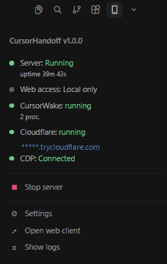

## Chrome DevTools Protocol (CDP)

CursorHandoff attaches to Cursor's built-in debugging port to read chat state and send actions.

### CursorHandoff sidebar

Open **CursorHandoff** on the activity bar. **Start Server** launches the local server; the panel shows server and CDP status:



### Start Cursor with a debugging port

**Windows (PowerShell)**
```powershell
& "$env:LOCALAPPDATA\Programs\cursor\Cursor.exe" --remote-debugging-port=9222
```

**macOS**
```bash
open -a "Cursor" --args --remote-debugging-port=9222
```

**Linux**
```bash
cursor --remote-debugging-port=9222
```

When CDP is active, **Start Server** should turn the status indicator green.

More detail: [Remote debugging setup](command:cursorHandoff.openDoc?%22docs%2Fguide.md%23enable-cdp%22).
